# ComfyUI-Mykee-Nodes

A custom node collection for ComfyUI. Currently includes counter nodes, a
mask-invert node, a set of character-consistency nodes, a set of audio
nodes (merging/ducking, silence trimming, emotion/timbre control,
voice/accent matching, and general voice clean-up/restoration), StyleGAN
face-generation/vector nodes, image nodes (color-background
compositing, basic/advanced image switches, and a stripe remover), a seed node with a
lockable random seed, a universal XYZ plot, a text switch/batch node, and
a before/after text injection node (see below for all of these).
More Mykee nodes may be added here in the future.

Please note: I am not a programmer, so the code and descriptions for the 
nodes were written by Claude; I was involved in the design and testing 
of the nodes. Please use the nodes with this in mind!

Some nodes are modifications or enhancements of nodes created by other 
developers, these are specifically noted. Thank you to them!

## Installation

1. Copy this folder into `ComfyUI/custom_nodes/`, or use
   `git clone https://github.com/mykeehu/ComfyUI-Mykee-Nodes/` in `ComfyUI/custom_nodes/` folder,
   so the end result is `ComfyUI/custom_nodes/ComfyUI-Mykee-Nodes/`.
2. Restart ComfyUI.

To install the additional packages required for certain nodes, see the 
requirements.txt file for more information, 
and use the following command to install them as needed:

```
pip install -r requirements.txt
```

## Mykee Counter 

<p align="center">
  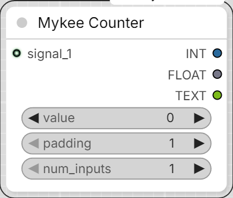
</p>


- **value** (INT) - the counter's current value. Can be overwritten by
  hand at any time before running (queuing) - counting then continues
  from there. After every run, the node automatically writes the new
  value back here.
- **padding** (INT, 1-10) - number of digits in the `TEXT` output.
  E.g. `padding = 1` -> `"1"`; `padding = 5` -> `"00001"`.
- **num_inputs** (INT, 1-50) - how many `signal_N` input sockets should be
  active. Increasing/decreasing this dynamically shows/hides sockets on
  the node (a connected socket is never removed automatically).
- **signal_1 ... signal_50** - inputs of any type (can be connected to any
  node's output). Only the first `num_inputs` of these are active.

### Outputs

- **INT** - the counter's new value as an integer.
- **FLOAT** - the same, as a float.
- **TEXT** - the value as text, zero-padded per `padding`.

### Logic

- The counter starts at `0` and is always a whole number (no decimals).
- If **any** of the active `signal_N` inputs receives data (not `None`),
  the counter increases by **exactly one**. If several inputs receive a
  signal in the same run, that only advances the counter once (it stops
  at the first match and doesn't check further).
- If none of the active inputs receive a signal (e.g. not connected, or
  the source node is inactive/disabled and so produces no output), the
  node does not raise an error - it simply doesn't advance the counter,
  and the current `value` passes through on the outputs.

## Mykee Counter (Seed Advanced)

<p align="center">
  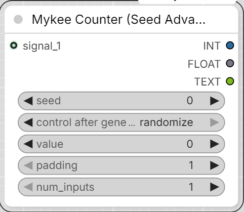
</p>


Same as "Mykee Counter", plus a dedicated **seed** (INT) field:

- The `seed` widget can be typed by hand, or turned into a connectable
  socket via right-click -> *"Convert widget to input"* (e.g. to feed it
  from a seed generator node).
- If `seed`'s value **differs** from the previous run: `value` resets to
  zero, then in the same run it checks the active `signal_N` inputs as
  usual - if one carries a signal, it advances from 0 to 1.
- If `seed` has **not changed**: everything proceeds per the usual
  "Mykee Counter" logic (advances from the current `value` if there's a
  signal).
- On the very first run (no prior value to compare against), this does
  not count as a change - the node starts normally.
- The node keeps the last-known `seed` value in the ComfyUI server's
  memory, keyed by the node's unique id (`unique_id`) - this persists
  until the server restarts.

## Mykee Invert Mask (Toggle)

<p align="center">
  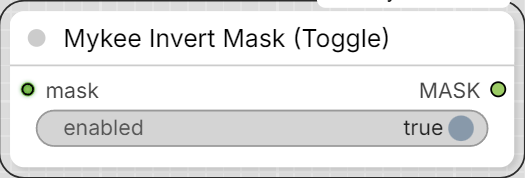
</p>


An enhanced version of the base ComfyUI "InvertMask" node with an
`enabled` (On/Off) toggle:

- `mask` (MASK) - the input mask.
- `enabled` (BOOLEAN, default: on) - if enabled, the mask is passed
  through inverted (`1.0 - mask`), just like the plain InvertMask. If
  disabled, the input mask is passed through unchanged.
- The `enabled` widget can be turned into a socket via right-click
  ("Convert widget to input"), so it can be driven not just by hand but
  also from another (sub)graph's/subtree's BOOLEAN output.

The node id is `MykeeInvertMaskToggle`, and it appears under the
`Mykee/Mask` category as "Mykee Invert Mask (Toggle)" - so it doesn't
clash with the built-in ComfyUI "InvertMask" node.

## Note

The dynamic socket handling (showing inputs based on `num_inputs`) works
through ComfyUI's JS frontend. If you call the node purely via the API
(without the frontend), the Python side still only looks at the first
`num_inputs` `signal_N` inputs, regardless of how many you actually
connected.

## Mykee/Character - character-consistency nodes

A ComfyUI-native rebuild of [Inline Studio](https://github.com/inlineresearch/Inline-Studio)'s
"Encode Character" logic. Inline Studio does the same thing with 3 small,
freely redistributable models (see the project's release notes):
**YuNet** (MIT) detects the face, **SFace** (Apache-2.0) computes a
128-dim face embedding from it, and **DINOv2-base** (Apache-2.0) computes
a 768-dim "subject" (body/clothing) embedding from the full reference
image. The score (cosine similarity) can be used to select/filter
generated takes - the same way Inline Studio scores every render.

### Installation / models

```
pip install -r requirements.txt
```

Place the YuNet and SFace `.onnx` files, as well as the `dinov2-base`
folder (in HuggingFace format), under `ComfyUI/models/annotators/` (the
nodes look here automatically, and list files from here in their
dropdowns too):

- `face_detection_yunet_2023mar.onnx` -
  https://huggingface.co/opencv/face_detection_yunet
- `face_recognition_sface_2021dec.onnx` -
  https://huggingface.co/opencv/face_recognition_sface
- `dinov2-base/` folder -
  https://huggingface.co/facebook/dinov2-base

If you type a HuggingFace repo id into the `dinov2-base` dropdown field
(e.g. `facebook/dinov2-base`) instead of a local folder, `transformers`
will download it automatically on first run.

### Nodes

**Mykee Face Detect + Align/Crop (YuNet)**

<p align="center">
  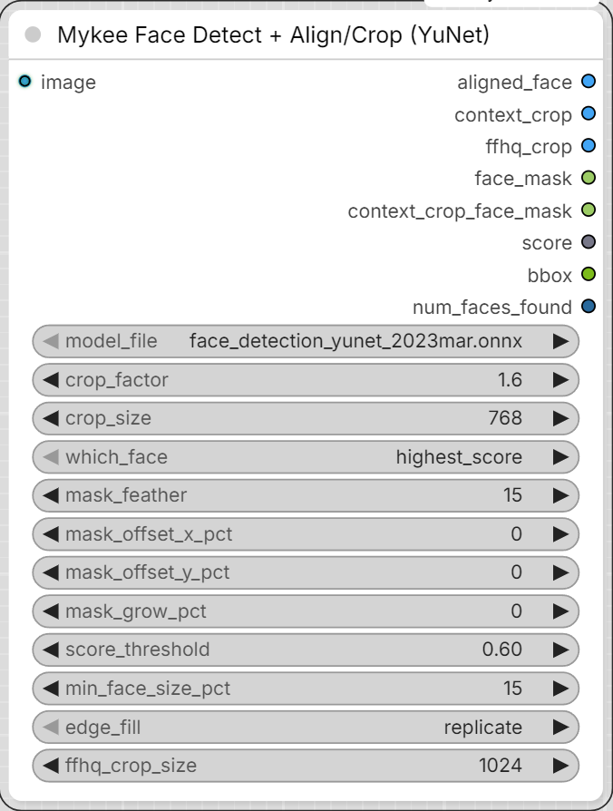
</p>

Input: an image. Finds the best face with YuNet (`highest_score` or
`largest`), and returns three crops:
- `aligned_face` - 112x112, aligned via the similarity transform computed
  from the 5 landmarks (eyes level) - this feeds the SFace embedding
  node.
- `context_crop` - sized by `crop_factor` (a direct multiple of the face
  bbox's larger side - same convention as Impact-Pack's FaceDetailer
  `bbox_crop_factor`, so the two are directly comparable: `crop_factor=1.0`
  is a tight crop, `3.0` matches a typical FaceDetailer setting) and
  scaled to `crop_size` - this is the "clean, contextual reference" worth
  feeding into your Krea 2 / MiniMax H3 workflow (Inline Studio's own
  documentation also notes that results are better when references are
  cropped, and you don't, say, mix the face into a clothing reference).
- `ffhq_crop` - NVIDIA's actual FFHQ dataset alignment recipe (eye/mouth-
  based rotation+crop - not a plain resize), scaled to `ffhq_crop_size`.
  Feed THIS into the StyleGAN Editor node's `image` input instead of a
  plain resize/crop - a `stylegan2-ffhq-*.pkl` generator's own latent
  space was trained on exactly this framing, so GAN-inversion projects
  much more faithfully onto it than onto an arbitrary crop (a loose
  portrait with lots of background/shoulders, say, tends to make the
  projection collapse into something distorted - see "Notes / caveats" in
  the StyleGAN section). Uses `edge_fill` for its own padding, same as
  `context_crop`. Falls back to a resized `context_crop` on the rare
  degenerate-landmark case (near-collinear eyes/mouth) rather than
  failing the node.
- `face_mask` - a feathered mask of the face region at the original
  image's resolution; can be connected to a regional-conditioning node's
  mask input (e.g. so identity reinforcement acts mainly on the face).
- `score`, `bbox` - detection confidence and the raw bbox as text.
- `num_faces_found` - how many faces were found in total, AFTER the
  `min_face_size_pct` filter (if you expected/got more than two, this
  tells you to check the `which_face` choice, `score_threshold`, or
  `min_face_size_pct`).

When there are multiple faces (e.g. a two-person image), `which_face` can
now also select by position, not just `highest_score`/`largest`:
`leftmost`/`rightmost`/`topmost`/`bottommost` - useful if your prompt also
distinguishes people as "the person on the left", and you need to know
which generated face belongs to whom (e.g. before Identity Score-ing).

**`min_face_size_pct`** - before `which_face`'s position-based selection
(leftmost/rightmost/etc.) runs, this filters out detections that are too
small relative to the largest detected face. Without it, a false-positive,
tiny background detection (e.g. a patterned bush, a fabric print) could
easily get picked as the "most extreme" face over a real, large face, if
it happens to sit at the edge of the image - this is exactly the bug that
can show up on two-person generated images.

`context_crop` is always a true square (no distortion on resize), even
when the face is close to the image edge: the missing margin is filled
per the `edge_fill` parameter - `replicate` by default (extends the edge
pixel row, safe, no duplicated features). `reflect` can duplicate features
(eye, ear) near the face - only pick this if you know the crop_factor margin
doesn't reach into face detail; `constant_gray`/`constant_black` give a
solid-color fill.

**There are two mask outputs - don't mix them up:**
- `face_mask` - in the ORIGINAL, uncropped image's resolution/coordinates.
  Only use this if the downstream node's image input also receives the
  original, full image.
- `context_crop_face_mask` - in `context_crop`'s OWN coordinate
  system/resolution (the same crop+resize transform is applied as for
  context_crop). If you feed `context_crop` as `image_1` into a node like
  Krea 2's "Reference Latent+" (`mask_1` input), connect THIS one - the
  plain `face_mask` would land in the wrong place/scale, since it's in a
  different coordinate system.

Both masks are ROTATED to match the head's tilt (using the angle computed
from the two eye landmarks), not a plain axis-aligned bbox - so a tilted
head won't have the mask spill out of the head/hair, or clip off real
face area on the other side.

**`mask_offset_x_pct` / `mask_offset_y_pct`** - corrects the center used
for BOTH `context_crop`'s crop window and both masks together, as a
percentage of the detected face's own width/height - they all move
together, so the mask keeps lining up with what `context_crop` actually
shows. `aligned_face` is unaffected (it's built from the 5 landmarks
directly, not the bbox center). Useful when YuNet's raw bbox center isn't
quite where you want the face framed (glasses, a receding hairline, or an
unusual angle can all throw it off slightly).

**`mask_grow_pct`** - grows (positive) or shrinks (negative) both masks
around their own (possibly offset-corrected) center, as a percentage of
the face's width/height. Deliberately separate from `crop_factor`: that
only changes how much surrounding context `context_crop` includes, not
the mask rectangle's own size - use `mask_grow_pct` when you want a
bigger/smaller mask at the same crop framing, not a bigger/smaller crop.
Only affects the masks, not `context_crop`/`aligned_face`.

**Mykee Face Embed (SFace)**

<p align="center">
  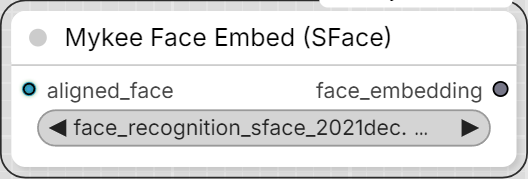
</p>

128-dim face embedding from the `aligned_face` input.

**Mykee Subject Embed (DINOv2)**

<p align="center">
  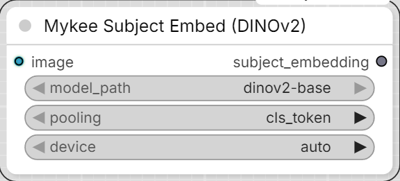
</p>

A 768-dim "subject" embedding from a full (not just face-cropped)
reference image - this is what captures body-shape/clothing consistency
where SFace only ever looks at the face.

**Mykee Identity Score (cosine)**

<p align="center">
  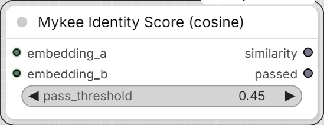
</p>

Cosine similarity between two embeddings (either can be a face or subject
embedding, as long as both inputs have the same dimensionality).
`similarity` (FLOAT) + `passed` (BOOLEAN, per `pass_threshold`) - this
lets you automatically filter/rank generated takes by how faithfully they
match the reference identity.

**IMPORTANT:** this node does NOT take an image - it wants the output of
the `Face Embed (SFace)` or `Subject Embed (DINOv2)` node. The correct
chain, for both the reference AND the generated image, separately:
```
image -> Face Detect+Align/Crop -> aligned_face -> Face Embed (SFace) -> face_embedding
```
and you connect the two `face_embedding` outputs to Identity Score's
`embedding_a`/`embedding_b` - not the images themselves. If someone
accidentally connects an image anyway, the node now detects this and
gives a clear error message instead of silently computing a meaningless
result.

If the generated image has more than one person, use the
`which_face: leftmost`/`rightmost` option (see above) to pick whose face
to crop out with the Face Detect+Align/Crop node and compare against the
right reference.

**Mykee Identity Compare (Multi-Person)**

<p align="center">
  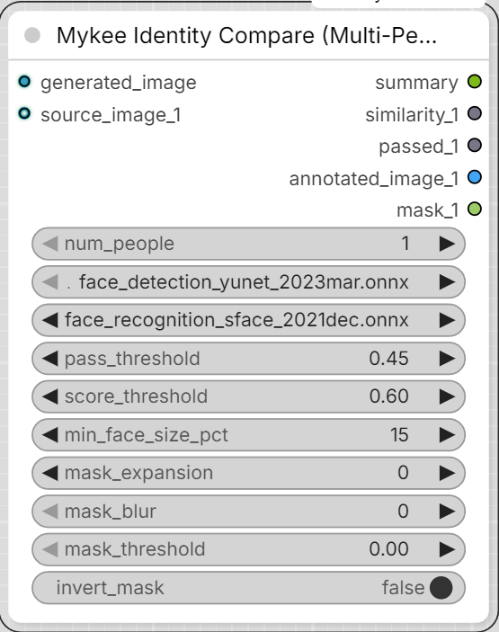
</p>

An all-in-one convenience node - no need to build a separate Face Detect +
Face Embed chain; it takes images directly:
- `generated_image` - the generated image to evaluate
- `num_people` (1-10) - a live switch: adds/removes the `source_image_N`
  inputs and the `similarity_N`/`passed_N`/`annotated_image_N`/`mask_N`
  outputs to match, so the node only shows as many "slots" as you
  actually need
- `source_image_1` ... `source_image_N` - one reference image per person

Every face detected in `generated_image` is compared against every
connected `source_image_N`. A reference person can appear MORE THAN ONCE
in `generated_image` (e.g. a side-by-side comparison of several
takes/generations of the same person) - so every detected face that
scores at or above `pass_threshold` against that reference counts as a
match, not just the single highest-scoring one. `similarity_N`/
`passed_N` report the single BEST match found (a simple pass/fail
number); `annotated_image_N` boxes/labels EVERY matching face for that
person (green if it passed, red if not - if nothing passed, the closest
attempt is still shown, labelled MISMATCH, so the output isn't blank);
`mask_N` is a MASK covering that same set of matching face(s) (a union
of their bounding boxes), ready to wire straight into a face-editing/
inpainting node without a separate detection step.

`mask_expansion`/`mask_blur`/`mask_threshold`/`invert_mask` (applied in
that order) shape every `mask_N` output the same way:
- `mask_expansion` - grows (positive) or shrinks (negative) the mask, in
  pixels, via dilate/erode.
- `mask_blur` - softens the edge with a Gaussian blur (radius in pixels,
  applied after expansion).
- `mask_threshold` - only used when `mask_blur` > 0; re-binarizes the
  blurred mask at this cutoff, removing the soft edge the blur left. 0 =
  disabled, keeping a soft/feathered edge.
- `invert_mask` - selects everything EXCEPT the matched face area(s)
  instead. A person with no match at all (not connected, or nothing
  detected) gets an all-zero mask (all-one if `invert_mask` is on).

A face-detection failure for one particular `source_image_N` (e.g. no
face found because `score_threshold`/`min_face_size_pct` was set too
aggressively) no longer aborts the whole node - it shows a non-blocking
ComfyUI toast notification and that one person is skipped
(`similarity_N=-1`, `passed_N=False`, blank `mask_N`) while everyone else
is still matched normally. `summary` (STRING) is a human-readable
breakdown of every match, mismatch, and warning - connect it to a Show
Text node.

This node also has a `min_face_size_pct` parameter (15% by default):
without it, a false-positive, tiny background detection could easily get
matched as a "person" over a real face - which is exactly what
`annotated_image_N`/`mask_N` would then show (the box/mask sitting on
the false detection instead of the real face).

**Mykee Character Reference Pack**

<p align="center">
  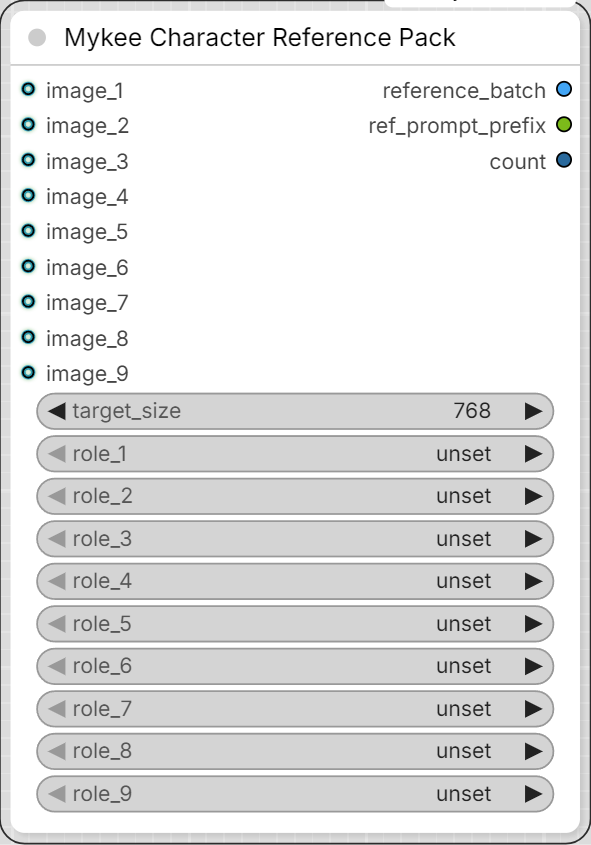
</p>

Up to 9 `image_N` inputs (each with an optional `role_N`:
face/body/cloth_top/cloth_bottom/other), from which it builds a
common-size-scaled `reference_batch` (IMAGE) and a `ref_prompt_prefix`
(STRING, e.g. `<Picture 1> <Picture 2> <Picture 3>`) - built exactly the
way MiniMax H3's native reference-to-video node and prompt are structured.
`reference_batch` can be connected directly to the native "MiniMax H3
Reference to Video" node's image input; `ref_prompt_prefix` can be
prepended to the final prompt with a String Concatenate node.

### Suggested integration into existing pipelines

- **MiniMax H3 (video):** `Face Detect+Align/Crop` -> `context_crop` for
  every reference image -> `Character Reference Pack` ->
  `reference_batch` into the H3 node's image references,
  `ref_prompt_prefix` at the start of the prompt.
- **Krea 2 Edit (image), with your "Reference Latent+" node:** connect
  `context_crop` to one of Reference Latent+'s `image_N` inputs, and
  `context_crop_face_mask` to the matching `mask_N` (due to the
  coordinate match, only this mask output works here - not plain
  `face_mask`, see above). If you only want to strongly preserve facial
  identity and leave clothing/background to the prompt (which also
  matches your own prompt rules), turn off the corresponding image_N's
  `imageN_hair`/`imageN_body`/`imageN_clothes`/`imageN_background`
  toggles, and leave only `imageN_face` on - our mask marks "face" more
  precisely than the node's own internal auto-detection likely can.
- **Take selection in both cases:** the `Identity Score` computed from
  the reference's `aligned_face` and a frame of the generated
  image/video's SFace embeddings helps automatically filter out takes
  that drifted from the identity.

## Mykee/Audio - Mykee Audio Merger

<p align="center">
  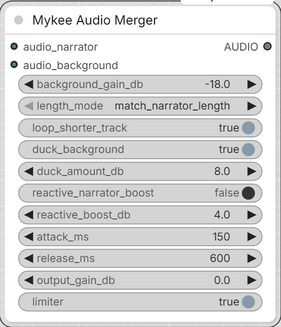
</p>


Two-input audio mixer: `audio_narrator` (foreground, e.g. TTS narration) +
`audio_background` (ambience/noise bed) -> one merged `AUDIO` output.
`audio_narrator`'s sample rate and channel layout are used as the output
reference; `audio_background` is resampled/channel-matched to it
automatically.

- **background_gain_db** - base level of the background relative to the
  narrator, before ducking.
- **length_mode** - which track's length the merged output follows
  (`match_narrator_length` / `match_background_length` /
  `match_longer_length`); the other track is looped or silence-padded to
  fit, per `loop_shorter_track`.
- **duck_background** + **duck_amount_db** - sidechain ducking: the
  background is automatically attenuated while the narrator is speaking.
- **reactive_narrator_boost** + **reactive_boost_db** - Lombard-effect
  style reaction: the narrator gets a bit louder when the background gets
  louder (e.g. a wind gust). Gain-only (no pitch/formant shifting), so it
  doesn't touch the narrator's voice character/accent.
- **attack_ms** / **release_ms** - how fast the ducking/reactive boost
  reacts to, and relaxes back from, a level change.
- **output_gain_db** - final trim.
- **limiter** - soft-clips (tanh) the merged output to prevent digital
  clipping; only audibly colors the sound near/above 0 dBFS peaks.

The ducking/reactive-boost envelopes are computed at a low control rate
(200 Hz) for speed, each track's amplitude is peak-normalized to its own
maximum before being applied - so `duck_amount_db`/`reactive_boost_db`
describe the effect at each track's own loudest moment, not an absolute
dB threshold. If the merge sounds off, that's the first thing worth
tuning by ear per source pair.

## Mykee/Audio - Mykee Silence Remover

<p align="center">
  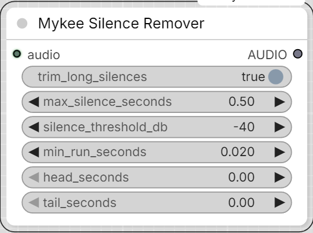
</p>


Caps long silent gaps inside an `AUDIO` clip down to a set maximum
length, and optionally pads fresh silence onto the start/end. Useful for
cleaning up dead air from any source, not just this pack's own TTS
nodes - a generated take with an overlong pause, a recording with excess
room tone between phrases, etc.

- **trim_long_silences** - finds runs of near-silence (by RMS energy, on
  a channel-averaged envelope so stereo imaging is preserved) longer
  than **max_silence_seconds** and cuts each down to exactly that
  length. Shorter pauses are left completely untouched, and actual audio
  content is never trimmed.
- **silence_threshold_db** - how quiet (dBFS) counts as silence; lower
  (more negative) to only catch near-total silence, raise it to also
  catch quiet room tone/breath noise.
- **min_run_seconds** - the frame size used to detect silence; smaller
  catches shorter gaps but is more sensitive to brief dips (consonant
  stops, etc.).
- **head_seconds** / **tail_seconds** - seconds of silence padded onto
  the very start/end of the (possibly now-shorter) result, added *after*
  trimming.

A batched `AUDIO` input is processed per-item (each clip trimmed on its
own silence pattern); since trimming can leave clips at different
lengths, the batch is re-padded with trailing silence to a common length
afterward so it's still a valid single `AUDIO` output.

## Mykee/Audio - Mykee Stereo To Mono

<p align="center">
  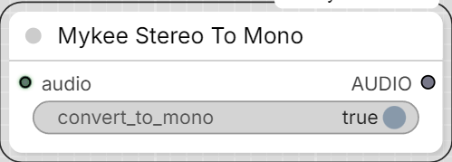
</p>


Simple channel-count normalizer: forces the `AUDIO` output to mono or
stereo regardless of whether the input already is mono or stereo.

- **convert_to_mono** OFF - output is stereo. A mono input is duplicated
  to both channels; a stereo input passes through unchanged.
- **convert_to_mono** ON - output is mono. A stereo input is downmixed
  (channel-averaged); a mono input passes through unchanged.

## Mykee/Audio - Mykee Audio Leveling

<p align="center">
  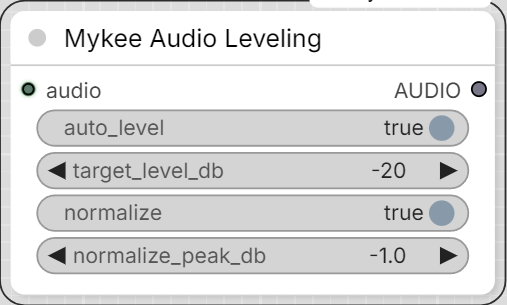
</p>


Fixes level drift/wandering in an `AUDIO` clip - e.g. a speaker who moved
closer to/further from the mic mid-recording - and/or normalizes its
overall peak loudness. Two independent stages, either can be switched
off on its own:

1. **auto_level** + **target_level_db** - rides the gain toward a
   consistent target RMS loudness, smoothed with attack/release so it
   doesn't pump on every syllable, with a hard peak-safety ceiling so it
   never introduces clipping regardless of how much gain the level
   target alone would otherwise call for. That ceiling itself eases in
   fast but releases slowly, so a single loud transient in an
   otherwise-quiet recording doesn't produce an audible momentary
   dip-and-recover right on the transient.
2. **normalize** + **normalize_peak_db** - a final overall gain trim so
   the clip's loudest peak sits at exactly `normalize_peak_db`, for
   consistent headroom across multiple clips.

Runs `auto_level` first (if on), then `normalize` (if on). Kept as its
own node (not folded into Mykee Audio DSP Cleanup) so it can go anywhere
in the chain relative to this pack's other audio nodes.

## Mykee/Audio - Mykee Emotion Timbre

<p align="center">
  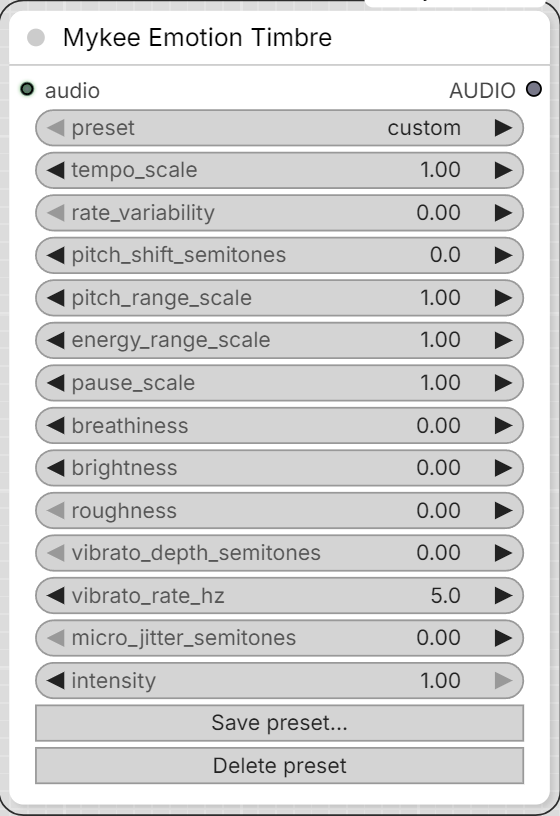
</p>


Also WORLD-vocoder-based, but built around what the emotional-speech-
prosody literature actually says drives perceived emotion in a voice:
**pitch range/variability, speaking rate (and how evenly it's paced),
loudness dynamic range, and pause length/frequency** - not static voice
timbre. (E.g. Yildirim et al. 2004; Major & Chatterjee's 2026 RAVDESS
analysis: anger/happiness show wider pitch range, higher rate, shorter
pauses; sadness shows the narrowest pitch range, slower rate, longer/more
pauses.) Voice-quality color (breathiness, brightness, roughness, vibrato)
is layered on top as a secondary cue, same as before.

Primary controls:
- **tempo_scale** / **rate_variability** - overall speed, plus optional
  uneven/erratic pacing on top of it (rushing and catching itself, rather
  than a perfectly steady speed change).
- **pitch_shift_semitones** / **pitch_range_scale** - register, and how
  much the pitch moves around its own median (narrow = monotone/sad,
  wide = animated/anger-happiness).
- **micro_jitter_semitones** - a small amount of natural-sounding random
  pitch flutter. Mainly useful
  when `pitch_range_scale` is pushed far from 1.0 and the result starts
  sounding too clean/robotic.
- **energy_range_scale** - loudness dynamic range (flat/subdued vs. quiet
  parts quieter and loud/shouted parts louder).
- **pause_scale** - independently stretches or compresses just the
  low-energy, pause-like stretches of the recording (auto-detected from
  the WORLD spectral envelope's frame energy) - speech portions keep
  their own rate. This is what actually produces "more/longer pauses" for
  sadness or "short, clipped pauses" for anger, rather than a uniform
  slowdown/speedup.

Secondary controls (same as the first version): **breathiness**,
**brightness**, **roughness**, **vibrato_depth_semitones** /
**vibrato_rate_hz**.

A **preset** dropdown (`custom` + whatever's in `mood_presets.json`, in
the pack's root folder) is a saved combination of all of the above.
Picking a named preset loads its values into the sliders and keeps
showing that preset's name - it does not silently reset to `custom`.
Changing any slider by hand, though, does switch the dropdown to
`custom`, since the label should never claim a mood that isn't actually
what's about to run.

**Save preset...** and **Delete preset** buttons on the node let you
manage `mood_presets.json` from inside ComfyUI - no manual file editing,
no restart needed. Save prompts for a name (overwrites if it already
exists) and writes the current slider values; Delete removes the
currently-selected preset. `custom` can't be saved over or deleted. (This
needs ComfyUI's own server running, since saving/deleting writes to disk
through a small API the node pack registers - `web/mykee_emotion_timbre.js`.
If you ever want to add moods by hand instead, editing `mood_presets.json`
directly still works exactly as before and shows up without a restart
too, since the dropdown re-fetches the current preset list.)

Shipped starting points (grounded in the literature above but not
measured on any particular voice - tune by ear, then Save over them):
`neutral`, `sad`, `dreamy`, `angry`, `longing`, `tired`, `excited`.

- **intensity** - blends every parameter above toward its neutral value
  (not a waveform crossfade - tempo/pause changes alter the output's
  duration, so a sample-domain dry/wet blend wouldn't line up once the
  two aren't the same length anymore).

(The rate_variability pacing noise and roughness/shimmer randomization
use a fixed internal seed - no user-facing seed control, since neither
is meant to be a "roll the dice for a different take" kind of random.)

Note: because tempo/pause changes actually change duration, this node's
output can be noticeably shorter or longer than its input - keep that in
mind if you're syncing to a fixed-length video track.

Note: `energy_range_scale`/`energy_emphasis` (this node and Mykee Prosody
Shaper) only reshapes the dynamics of stretches that already have some
real signal in them - near-silent stretches (pauses, the WORLD vocoder's
own residual noise floor) are left at their original level regardless of
the scale, via a gate relative to the loudest frame in the clip. Without
this, flattening the dynamics (scale < 1, e.g. most "quieter/sadder"
presets) would pull those near-silent stretches up toward the loudness
median too, audibly raising the noise floor in every pause.

The same gate applies to `breathiness`, `brightness`, and `roughness`:
they only color frames that have real signal in them, not pauses/silence.
Without it, breathiness in particular ended up sounding like a constant
low-level air/mic-noise layer present even in gaps between phrases,
rather than a quality of the voice itself only while it's actually
speaking.

Note: `pause_scale` only stretches/compresses stretches of at least
~150ms - shorter low-energy dips (a stop-consonant closure, for example)
are never treated as a pause. Without this, brief closures could get
warped along with real pauses, which occasionally smeared a fast
consonant transition into a buzzy, noise-like texture.

Note: `breathiness`, `roughness`, `brightness`, and the tempo/pause warp
are each individually subtle at moderate values, but they compound - on
a loud, sustained vowel, stacking several of them together (as most
presets do) measurably softens harmonic clarity even though no single
one of them is doing anything dramatic on its own. The shipped presets
keep breathiness/roughness modest for exactly this reason. If a preset
still sounds textured/noisy to you on a particular vowel, that's the
first place to back off - and `intensity` scales all of it down
uniformly if you'd rather keep the preset's balance and just reduce the
total effect.

Note: both nodes' final safety stage is a linear peak-scale-down (never
up), not a soft-clip/tanh limiter - a limiter adds harmonic distortion
whenever it actually engages, and since breathiness/brightness/roughness
each add a bit of extra energy on top of the original signal, a source
that's already sitting at or near 0 dBFS (common for TTS output) has
zero headroom to absorb that. Linear scaling only ever changes overall
level, never the waveform's shape, so it can't itself be a source of the
"noisier than the input" complaint the way a hard limiter can.

### Note on the pyworld/pkg_resources install quirk

`pyworld` imports `pkg_resources` at load time just to read its own
version string, but recent `setuptools` versions no longer ship
`pkg_resources`. Rather than pinning `setuptools` to an old version
(fragile - torch, ComfyUI, or any other package can bump it back up
later), `mykee_prosody.py` stubs out just that one call with the
stdlib's `importlib.metadata` if `pkg_resources` isn't available, so
this works regardless of whatever `setuptools` version ends up
installed. If a real `pkg_resources` is present, the shim gets out of
the way and isn't used.

Mykee Emotion Timbre can be chained
directly into **Mykee Audio Merger**'s `audio_narrator` input.

## Mykee/Audio - Mykee Voice/Accent Match

<p align="center">
  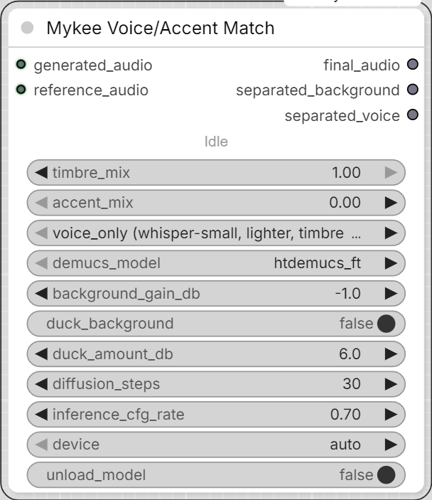
</p>


A universal, model-independent post-processor: takes any generated audio
plus a short reference sample and reshapes the generated voice's timbre
and/or pitch-level/accent character to match the reference - regardless of
what produced the generated audio (any TTS model, any generator). Unlike
every other node in this pack, this one is **not** pure signal processing -
it runs real neural models (source separation + a voice-conversion
diffusion model) and needs a CUDA GPU in practice.

**Pipeline:** Demucs separates voice from background on both inputs (so
music/SFX mixed into either track doesn't get treated as speech) -> Seed-VC
(https://github.com/Plachtaa/seed-vc) converts the isolated vocals ->
the converted voice is remixed with the generated audio's own separated
background.

- **generated_audio** / **reference_audio** - two AUDIO inputs. The
  reference does not need to say the same words as the generated audio -
  a few seconds up to about 25 seconds is used; more doesn't help much
  beyond that.
- **timbre_mix** (0-1) - how much of the reference's voice/timbre to
  blend in, continuously between the generated audio's own voice (0.0)
  and the reference's (1.0). Implemented as a linear blend of the two
  audio's CAM++ speaker embeddings before conditioning Seed-VC on it.
- **accent_mix** (0-1) - how much of the reference-vs-source pitch-level
  difference to apply, from none (0.0, keeps the source's own pitch
  level) to all of it (1.0, matches the reference's level exactly).
  Above 0, this uses the heavier whisper-base+F0 Seed-VC variant. Works
  even with `timbre_mix` at 0 - Seed-VC still needs *some* style vector
  to condition on, and at `timbre_mix=0` that's the source's own, so
  timbre stays close to unchanged while pitch still shifts. (Both at 0
  skips Seed-VC entirely and passes the separated voice through
  unconverted.)
- **model_variant** - which Seed-VC checkpoint pair to use. Each bundles
  a specific Whisper size it was trained with (whisper-small for
  voice-only, whisper-base for voice+accent) - these can't be freely
  mixed and matched, so this isn't a general "pick any Whisper size"
  control the way the name might suggest. Ignored (the F0 variant is
  used automatically) whenever `accent_mix` is above 0.
- **demucs_model** - separation model (`htdemucs_ft` default, higher
  quality but slower).
- **background_gain_db** / **duck_background** / **duck_amount_db** - same
  mixing mechanism as Mykee Audio Merger, applied to the generated audio's
  own separated background when remixing it back under the converted voice.
- **diffusion_steps** / **inference_cfg_rate** - Seed-VC's own
  quality/speed and content-fidelity controls.
- **device** - `auto`/`cuda`/`cpu`. CPU will be extremely slow for this
  pipeline (Demucs + Whisper + a diffusion transformer).
- **unload_model** - frees the Seed-VC and Demucs models from VRAM once
  the run finishes (clears this node's model caches, then asks PyTorch/
  CUDA to actually release the freed memory). Off by default, so repeat
  runs in the same session stay fast; turn it on if you need the VRAM
  back for something else afterward.

A small status line under the node's title (Separating vocals... /
Loading Seed-VC model... / Converting voice... / Mixing... / Done) mirrors
what gets printed to the console, since several of these stages can take
a while. ComfyUI's own native green progress bar (the same one KSampler
shows) tracks the same milestones on top of that.

**Outputs:** `final_audio` (converted voice remixed with the original
background), `separated_background` (generated_audio's background alone,
in case it's useful elsewhere), `separated_voice` (the voice stem after
conversion, before remixing).

**Models:** downloaded automatically on first use into shared,
non-node-specific folders - `ComfyUI/models/whisper/`,
`ComfyUI/models/Seed-VC/`, `ComfyUI/models/CAMpp/`,
`ComfyUI/models/htdemucs/` - so other tools that expect models in those
conventional locations can reuse the same files. The Seed-VC *code*
(not weights) is vendored via a one-time `git clone` into this node
pack's own `third_party/seed-vc/` folder, since it's a full application
repository, not a pip package; that upstream repo was archived
(read-only) in November 2025, so it still works but won't receive
further updates.

Note: on first use, the vendored Seed-VC code also gets a one-time,
automatic rename of its `modules` package, `hf_utils.py`, and
`inference.py` to unique, `mykee_seedvc_`-prefixed names (and every
reference to them rewritten to match). Those are common enough names
that another ComfyUI custom node pack easily ends up using the same
ones - Python caches imported modules by name for the whole process, so
without this, whichever pack imports its own `modules`/`inference`
first would silently "win" and the other would fail to import at all
(`ModuleNotFoundError`) or, worse, load the wrong one.

## Mykee/Audio - Mykee Audio DSP Cleanup

<p align="center">
  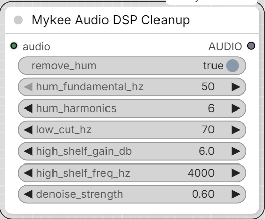
</p>


Fast, dependency-light DSP fixes for a recording made without a
dedicated/close mic - distant, off-axis, "in the background": low,
wandering level; muffled tonal balance; audible mains hum; background
room noise. No model download, runs fine on CPU.

- **remove_hum** + **hum_fundamental_hz** (50/60 Hz) + **hum_harmonics** -
  notches out AC mains hum (the fundamental and that many multiples of
  it) - e.g. from an ungrounded cable or a nearby power supply the mic
  picked up.
- **low_cut_hz** - a gentle high-pass to remove room rumble/handling
  noise. 0 disables. Keep it below a male voice's fundamental (~85 Hz+)
  so it doesn't thin out the voice.
- **high_shelf_gain_db** + **high_shelf_freq_hz** - boosts frequencies
  above that point to restore some presence/air a distant or off-axis
  mic loses (the muffled/dull quality). 0 disables.
- **denoise_strength** (0-1) - reduces steady background noise via
  spectral subtraction against a profile learned from the quietest parts
  of the clip. 0 disables; higher is more aggressive but can start
  sounding processed on already-clean audio.

Pairs well chained with **Mykee Audio Leveling** (level drift/normalize)
and **Mykee AI Voice Restore** (below) - run this one first to clean up
hum before the AI stage, after to touch up presence on the AI stage's
output, or on its own for a fast fix that doesn't need a model download.

A batched `AUDIO` input is processed per-item; results are re-padded
(silence/channel-repeated) to a common shape afterward.

## Mykee/Audio - Mykee Audio Dereverb

<p align="center">
  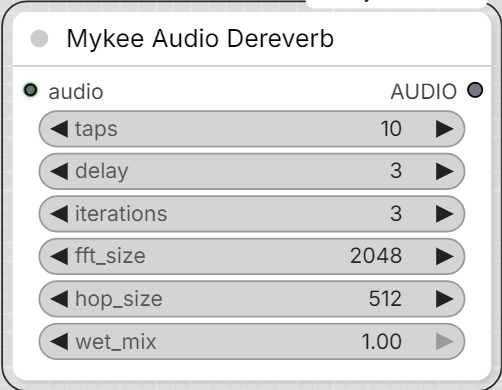
</p>


Reduces room reverb/echo via WPE (Weighted Prediction Error) - a
classical, non-neural late-reverberation suppression algorithm (not a
generative/voice-conversion model, so it can't alter the speaker's
timbre). Well-established in speech processing (used e.g. in the REVERB
Challenge baseline, Kaldi, ESPnet) - see
https://github.com/fgnt/nara_wpe, the library this node wraps. Kept as
its own node (not folded into Mykee Audio DSP Cleanup) so it can go
anywhere in the chain relative to the other Mykee audio nodes - e.g.
before Mykee AI Voice Restore, so the AI stage receives an already-
dereverbed signal.

- **taps** - filter length (STFT frames) used to predict/cancel the
  reverb tail. More can suppress a longer tail but costs more compute
  and, past a point, can start coloring the sound.
- **delay** - STFT frames right after the direct sound left untouched (a
  guard interval) - WPE only targets reverb *after* this, not early
  reflections/the direct sound itself.
- **iterations** - how many times WPE re-estimates its prediction filter
  against its own output; more can sharpen the result, with diminishing
  returns and more compute time.
- **fft_size** / **hop_size** - STFT frame size/hop, in samples. The
  defaults suit 44.1/48kHz speech; lower them for a much lower sample
  rate input.
- **wet_mix** (0-1) - blends the dereverbed signal back with the
  original. 1.0 = fully dereverbed; lower it if the full effect sounds
  over-processed for your material, or if you just want to take the edge
  off rather than eliminate the reverb.

WPE's effectiveness varies a lot by recording - it's genuinely strongest
with real multi-microphone-array diversity (its original use case), and
more modest on a single mic or a plain stereo recording (not spaced
mics). There's no substitute for listening and adjusting
taps/delay/iterations/wet_mix by ear for your specific material.

This is a CPU-only, numpy-based algorithm (no GPU acceleration, no model
download) - runs at roughly 0.3-0.5x realtime on a typical desktop CPU,
so a long clip will take a while; there's a progress status while it
runs. A batched `AUDIO` input is processed per-item.

## Mykee/Audio - Mykee Room Reducer

<p align="center">
  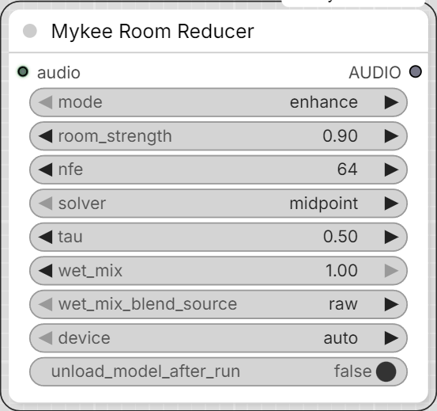
</p>


Reduces the "distant mic / roomy" character of a speech recording -
**not** the same problem as **Mykee Audio Dereverb** solves. WPE (that
node) is deliberately built to leave a guard interval right after the
direct sound untouched, so it only cancels the *late* reverb tail - it
does not touch early reflections or the room's own spectral coloration
(the "small/boxy/far" tonal signature a room stamps onto a distant or
off-axis recording even with zero audible echo). That coloration is
exactly what makes a clip sound "not into the mic" without there being
any audible slap or ring to point at - this node targets that instead.

Runs Resemble Enhance (https://github.com/resemble-ai/resemble-enhance,
`pip install resemble-enhance`) - a neural speech-enhancement model
trained specifically to map noisy/distant/reverberant recordings onto
studio-quality, close-mic-sounding output (a denoiser + a conditional-
flow-matching "enhancer" stage that also extends bandwidth). It is
complementary to WPE, not a replacement - chain them in either order;
WPE first tends to give the enhancer a cleaner signal to work with if
there's an audible late tail as well.

- **mode** - `enhance` (denoiser + CFM restoration - the one that
  actually reduces room coloration/distant-mic quality) or
  `denoise_only` (just strips background noise, lighter touch, won't
  do much for a roomy-but-quiet recording).
- **room_strength** (the model's own `lambd`, 0-1) - how hard the
  enhancer leans toward a close/dry/studio target vs. the original
  tonal character. Higher = treats the input as more distant/degraded.
  Only affects `enhance` mode.
- **nfe** / **solver** / **tau** - the enhancer's CFM ODE solver and how
  many steps it takes. Only affect `enhance` mode.
- **wet_mix** (0-1) - blends the processed signal back with the
  original (post-downmix, at the original sample rate). 1.0 = fully
  processed; lower it if the full effect sounds over-smoothed/
  artificial for your material.
- **wet_mix_blend_source** - what `wet_mix` blends *toward* when it's
  below 1.0. `raw` (default) blends toward the untouched input -
  simple, but since that still carries the original's room coloration/
  reverb, a low `wet_mix` can partly bring that back. `denoise_only`
  instead runs a quick denoiser-only pass of the same audio and blends
  toward that - still not as "dry" as the full enhance output, but
  doesn't reintroduce room coloration the way raw does, and is a good
  option if `enhance` alone sounds rougher/raspier than you'd like (see
  below). Only affects `enhance` mode; costs one extra (fast, non-ODE)
  model pass when it applies.
- **device** - `auto`/`cuda`/`cpu`.
- **unload_model_after_run** - frees Resemble Enhance from VRAM once
  the run finishes, via ComfyUI's own model manager. Off by default.

### Recommended settings

There's no official named preset list on the model's page - just the
default slider values in Resemble AI's own demo (their Hugging Face
Space), which is effectively the closest thing to an official
recommendation, and is what this node defaults to:

- **solver**: `midpoint` - their demo labels it "recommended".
- **nfe**: `64` - their demo's label: higher gives better quality but
  is slower (128 is the max).
- **tau**: `0.5` - their demo's label: higher can improve quality but
  can reduce stability/add artifacts.
- **room_strength / lambd**: their demo defaults this "off" (`0.1`) and
  only recommends turning it up (`0.9`) when the recording also has
  heavy *background noise* - not just room coloration. For a
  distant-but-otherwise-clean recording, keep this low (roughly
  `0.1`-`0.3`) so it doesn't over-push the audio toward an artificial
  "studio" sound.

Beyond that, it's trial and error on your own material - e.g. a
resemble-enhance GitHub issue (#64) has people trying combinations like
`nfe=128, tau=0.1` or `nfe=264, tau=0.0, solver=rk4` chasing extra
clarity, with mixed results. Use the values above as a starting point
and adjust by ear.

### A known `enhance`-mode trait: raspiness

The CFM restoration stage's bandwidth extension can "invent" plausible
but not-quite-right high-frequency detail, which can read as a rougher/
raspier voice quality than the same material run through `denoise_only`
alone - this isn't a bug, just a property of generative restoration.
If you notice this: try lowering `nfe`, `room_strength`, and/or `tau`
first (less aggressive restoration = less invented detail); if that's
still not clean enough but you still want some room-coloration
reduction, set `wet_mix_blend_source` to `denoise_only` and bring
`wet_mix` down from 1.0 - this blends the (rougher) enhance output back
toward a clean denoiser-only pass instead of the raw input, tamping
down the raspiness without reintroducing the room coloration/reverb
that blending toward raw would.

Only supports mono at a fixed 44100 Hz internally (like VoiceFixer in
**Mykee AI Voice Restore**) - stereo input is downmixed, and the output
is resampled back to the *original* input's sample rate. A batched
`AUDIO` input is processed per-item; results are re-padded with
trailing silence to a common length afterward. Needs a GPU for
reasonable speed (CPU is very slow, especially at higher `nfe`).

The node shows a KSampler-style progress bar while it runs. It tracks
both the 30 s audio chunks and the solver steps inside each chunk (plus
the extra denoise pass when `wet_mix_blend_source` is `denoise_only`),
and Cancel now takes effect mid-clip instead of only between batch items.

### Checkpoint location

Unlike this pack's other AI nodes (VoiceFixer, Seed-VC), this one's
~1GB checkpoint is left at Resemble Enhance's *own* default download
location (inside the installed `resemble_enhance` package folder,
under `model_repo/enhancer_stage2/`, fetched via `git clone` + Git LFS)
rather than redirected into `ComfyUI/models/`. The library resolves a
second, nested download (the denoiser submodule's weights) via a path
baked into the downloaded `hparams.yaml` itself - reimplementing that
redirection to a custom folder would mean also reverse-engineering that
inner path, with a real risk of silently loading an empty/untrained
denoiser if it's gotten wrong. Left at the library's own default, this
is guaranteed to match how the authors' own demo app uses it. Needs
`git` (and Git LFS) available on your system the first time this node
runs, and network access to huggingface.co.

### Windows installation notes

Plain `pip install resemble-enhance` **will fail** on Windows - it
pulls in `deepspeed==0.12.4`, and pip tries to build deepspeed's
`async_io` (AIO) op from source, which needs a Linux-only `libaio` and
always fails on Windows with `LINK : fatal error LNK1181: cannot open
input file 'aio.lib'`. This node never touches deepspeed's actual
training/distributed code - it only needs `import deepspeed` to
succeed (unavoidable, since it's imported transitively even on the
inference-only code path). Fix:

1. Install a **precompiled** Windows deepspeed wheel instead of letting
   pip build one - e.g.
   https://github.com/6Morpheus6/deepspeed-windows-wheels (Python
   3.9-3.12, no CUDA toolkit needed). Match your ComfyUI
   `python_embeded`'s Python version.
2. `pip install resemble-enhance --no-deps` - the `--no-deps` is
   **critical**: resemble-enhance's own requirements pin
   `torch==2.1.1`/`torchaudio==2.1.1`/`torchvision==0.16.1`/
   `numpy==1.26.2`/`gradio==4.8.0`, which would downgrade ComfyUI's own
   working torch/CUDA stack without it.
3. Manually install the handful of small, harmless deps it still needs
   that ComfyUI's environment doesn't already provide:
   `pip install celluloid==0.2.0 ptflops==0.7.1.2 resampy==0.4.2 omegaconf==2.3.0 "tabulate>=0.9.0"`
   (**not** `tabulate==0.8.10` as resemble-enhance's own pin says - a
   ComfyUI-provided pandas already requires `tabulate>=0.9.0`; the
   version only affects a startup-time log line, nothing functional).

Two more Windows-only quirks in the checkpoint/library itself, both
already worked around **inside this node** (nothing extra to install
for these):

- The downloaded checkpoint's `hparams.yaml` was saved on a Linux
  machine, so a couple of its (training-only, never read at inference)
  `Path`-typed fields got serialized as
  `!!python/object/apply:pathlib.PosixPath` YAML tags - which Python
  3.12+ refuses to even instantiate on Windows, crashing the very first
  model load with `cannot instantiate 'PosixPath' on your system`. This
  node aliases `pathlib.PosixPath` to `WindowsPath` for the duration of
  that one parse.
- `enhance` mode's CFM solver does `float(scipy.optimize.fsolve(...))`
  to turn a 1-element array into a Python float - fine on the
  `numpy==1.26.2` resemble-enhance itself pins, but numpy 2.x (what a
  ComfyUI environment installed with the `--no-deps` approach above
  almost certainly already provides) raises `only 0-dimensional arrays
  can be converted to Python scalars` instead. This node patches that
  one method in place with an equivalent, numpy-2.x-safe version.

## Mykee/Audio - Mykee AI Voice Restore

<p align="center">
  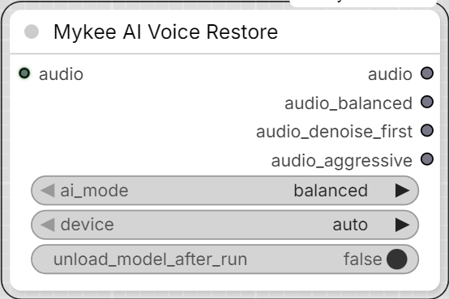
</p>


Runs VoiceFixer (https://github.com/haoheliu/voicefixer), a model trained
specifically to restore degraded speech (denoise + de-reverb + bandwidth
extension in one pass) while preserving the speaker's own
identity/voice. Stronger than **Mykee Audio DSP Cleanup** alone,
especially for reverb/room tone the DSP node doesn't specifically
address - but slower, and needs a GPU for reasonable speed.

- **ai_mode** - `balanced` (mode 0, VoiceFixer's default) /
  `denoise_first` (mode 1 - strips very harsh/high-frequency noise before
  restoring; try this if `balanced` leaves noise artifacts) / `aggressive`
  (mode 2 - VoiceFixer's own "more effective on seriously damaged speech"
  mode; can sound less natural on already-decent audio) / `all` - runs
  all three and gives you a separate output *per mode*, e.g. to A/B them
  with a Preview Audio on each, instead of one blended result.
- **device** - `auto`/`cuda`/`cpu`.
- **unload_model_after_run** - frees VoiceFixer from VRAM once the run
  finishes, via ComfyUI's own model manager. Off by default.

**Outputs:** `audio` carries the result for the `balanced`/
`denoise_first`/`aggressive` modes; `audio_balanced` /
`audio_denoise_first` / `audio_aggressive` carry nothing in that case.
For `all`, it's the reverse: `audio` carries nothing, and the three
named outputs each carry their own mode's result. "Carries nothing"
means that output doesn't fire at all for that run (via ComfyUI's
`ExecutionBlocker`) - any node relying solely on it simply doesn't
execute, rather than receiving an empty/`None` value.

VoiceFixer only supports 44100 Hz mono, so stereo input is downmixed;
every output is always resampled back to the *original* input's sample
rate, so this node's output rate matches its input rate. Output is mono
regardless of the input's channel count - chain **Mykee Audio DSP
Cleanup** after this if you specifically need a stereo result (it will
just apply the same processing to the single channel).

A batched `AUDIO` input is processed per-item; results are re-padded
with trailing silence to a common length afterward.

**Models:** downloaded automatically (from Zenodo, a few hundred MB
total) into `ComfyUI/models/VoiceFixer/`, the first time this node is
actually used. Requires the `voicefixer` pip package to be installed
(see `requirements.txt`) and network access to zenodo.org on that first
use.

VoiceFixer's own checkpoint-fetching code has **no** built-in option to
redirect where it downloads to - left alone, it would always use
`~/.cache/voicefixer/` (on Windows, `%USERPROFILE%\.cache\voicefixer\`),
not a shared `ComfyUI/models/...` folder like this pack's other AI
nodes. This node works around that the same way it already redirects
Seed-VC's and Demucs's own downloads (`HF_HUB_CACHE`/`TORCH_HOME`):
by briefly overriding the `HOME`/`USERPROFILE` environment variables -
what `expanduser("~")` actually reads - for just the moment VoiceFixer's
checkpoint-download code runs, then restoring them immediately after.

### Limitations

Handles only a single (best-score or largest) face per image - in
multi-person scenes, if the character you're after isn't unambiguously
the best match, you need to manually pre-select/crop the reference.
DINOv2's "subject" embedding is not face-specific, so it can give a high
similarity for the same person even across a clothing/pose change - it's
good as a rough estimate of body-shape/overall-look consistency, not as
identity-deciding evidence.

## StyleGAN Facegenerator / StyleGAN Facegenerator Vector Editor

Four nodes (`Mykee/StyleGAN` category) built around a StyleGAN2/3 generator
`.pkl` (e.g. `stylegan2-ffhq-1024x1024.pkl`).

### Folder layout

```
ComfyUI/models/stylegan/*.pkl                          - generator checkpoints
ComfyUI/models/stylegan/vgg16.pt                        - auto-downloaded on first vector generation
ComfyUI/models/stylegan/facegen_vectors/<name>.npy      - a direction vector (W-space delta)
ComfyUI/models/stylegan/facegen_vectors/<name>.json     - that vector's parameters
```

Each `<name>.json` looks like:

```json
{
  "layer_start": 0,
  "layer_end": 17,
  "step": 0.25,
  "min": -2.0,
  "max": 2.0,
  "source_mode": "image",
  "seed_a": 100,
  "seed_b": 200,
  "seed_truncation": 0.7,
  "projection_steps": 300,
  "projection_seed": 12345
}
```

- `layer_start`/`layer_end` - inclusive range of W+ layers the vector is
  added to - see "Layer reference" below for what each range tends to
  control on this model.
- `step` - a flat multiplier applied on top of whatever the Image
  Generation/Editor slider is set to.
- `min`/`max` - the Image Generation/Editor slider's range for that vector.
- `source_mode`/`seed_a`/`seed_b`/`seed_truncation`/`projection_steps`/
  `projection_seed` - written automatically by the Vector Save node,
  recording exactly how the vector was built (whichever of these actually
  applied for that `source_mode`) so you can reproduce it later - given
  the same model and, for `image` mode, the same two source photos. The
  images themselves (and their filenames) are deliberately never stored,
  only the generation settings. None of these six drive the Image
  Generation/Editor sliders - they're purely for your own reference, and
  hand-editing or removing them is harmless.

### Layer reference

Which W+ layer range tends to control what, per model. Add a new
sub-section here for any other StyleGAN2/3 model you use with this pack -
the layer count and what each range controls depends on the model's
output resolution and what it was trained on, so this table doesn't
transfer directly to a different generator.

#### `stylegan2-ffhq-1024x1024.pkl` (18 layers, 0-17)

A 1024px model has 18 W+ layers (`log2(1024) x 2 - 2`), one pair per
resolution doubling from 4x4 up to 1024x1024. They roughly split into
three groups - this is the original StyleGAN paper's own style-mixing
breakdown, not something specific to this pack:

| Layers | Resolution | Tends to control |
|---|---|---|
| 0-3 | 4x4 - 8x8 | Coarse: pose/camera angle, overall face shape/skull structure, general hairstyle silhouette (short vs long), presence of glasses |
| 4-7 | 16x16 - 32x32 | Middle: finer facial features - eye/eyebrow/nose/mouth shape, more detailed hairstyle |
| 8-17 | 64x64 - 1024x1024 | Fine: color (skin, eye, hair), lighting, micro-texture/skin detail, background |

Vectors are rarely purely one category - a real attribute like "gender"
mixes coarse (jaw/brow structure) and middle (finer features) signal, and
restricting layers only reduces entanglement, it doesn't eliminate it.
Concrete `layer_start`-`layer_end` ranges used by the original
`generate2.py` Gradio app, as a starting point:

| Vector | Layers | Typical `step` |
|---|---|---|
| gender | 0-8 | x1.5 (soft) or x1.0 with `min`/`max` -10/10 (hard) |
| age | 1-7 | x2.5 |
| smile | 4-5 | x2.5 |
| skincolor | 10 | x0.25 |
| eyecolor | 11-12 | x0.15 |

Color-only attributes (eye/skin color) sitting entirely in the fine
range (8-17) are the hardest to isolate well via photo-based vector
building - see the note on VGG-based projection under-weighting color in
"Notes / caveats" below.

#### `stylegan-human-v2-1024x512.pkl` (full-body, not a face model)

The [StyleGAN-Human](https://github.com/stylegan-human/StyleGAN-Human)
project's SHHQ-trained generator - built on the same NVIDIA stylegan2-ada
codebase this pack vendors, so every node here works on it exactly the
same way as the FFHQ face model, just with a full-body person instead of
a face. Auto-downloads from Google Drive the same way the FFHQ model
auto-downloads from NVIDIA - see "Notes / caveats" below.

At 1024x512 (2:1, not square) its exact `num_ws` layer count - and so
which layer ranges map to which part of the body - hasn't been verified
against this pack's code yet; test with `layer_start=0, layer_end=31`
(the widest range the Save node's layer fields allow) to see the full
effect of a vector before narrowing it down, the same exploratory way you
would for the coarse/middle/fine breakdown above.

### Mykee StyleGAN Image Generation

<p align="center">
  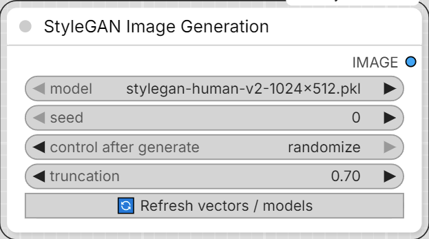
</p>


(Internally still `MykeeStyleGANFaceGenerator` / keyed around "face" since
this pack's vectors are built for faces - but any StyleGAN2/3 generator
works the same way regardless of what it was trained to produce.)

- **model** - a `.pkl` from `models/stylegan`.
- **seed** / **truncation** - same meaning as in your Gradio app
  (`truncation_psi`).
- One slider per file in `facegen_vectors/` is added automatically, using
  that vector's own `min`/`max`/`step`. 0 = neutral.
- **🔄 Refresh vectors / models** re-scans both `models/stylegan`
  (models) and `facegen_vectors` (vectors + their current JSON params) and
  rebuilds the sliders - no ComfyUI restart needed after adding or
  re-saving a vector. Existing slider values are kept where the vector
  still exists.
- Output: **IMAGE**.

### Mykee StyleGAN Editor

<p align="center">
  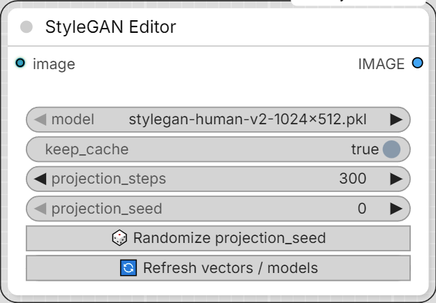
</p>


Same idea as Image Generation, but edits an existing photo instead of
generating from a seed - the "GAN inversion + latent editing" technique
(project a real photo into W space, nudge it along your saved direction
vectors, re-synthesize). Same vector sliders, same refresh button, same
`facegen_vectors/` source - just a different starting point than a seed.

- **image** - the photo to edit.
- **model** - must be the same generator your vectors were built for.
- **keep_cache** - on by default. Projecting a photo into W space is the
  slow part (same GAN-inversion algorithm as the Vector Preparation node's
  `image` mode); once it's done for a given image/model/projection_steps/
  projection_seed combination, tweaking the vector sliders and re-running
  reuses that projection instead of redoing it - only the (cheap) vector
  math + re-synthesis happens again. Change the image, model, or
  projection settings (or turn this off) to force a fresh projection.
- **projection_steps** / **projection_seed** (with its own
  **🎲 Randomize projection_seed** button) - same meaning as on the Vector
  Preparation node: more steps = closer match to the photo, slower; the
  seed makes the projection reproducible.
- No **truncation** setting here (unlike Image Generation) -
  `truncation_psi` only affects `G.mapping()`'s seed→W step, which this
  node never calls; it starts from the photo's own projected W instead.
- One slider per file in `facegen_vectors/`, exactly like Image
  Generation, via the same **🔄 Refresh vectors / models** button.
- Output: **IMAGE**.
- Quality caveat: GAN inversion is lossy - backgrounds, jewelry, unusual
  hairstyles, or extreme angles often shift slightly just from the
  projection step, before any vector is even applied. Works best on
  FFHQ-style photos (front-facing, centered, similar framing to the
  training data), same as the Vector Preparation node's `image` mode.

### Mykee StyleGAN Vector Preparation

<p align="center">
  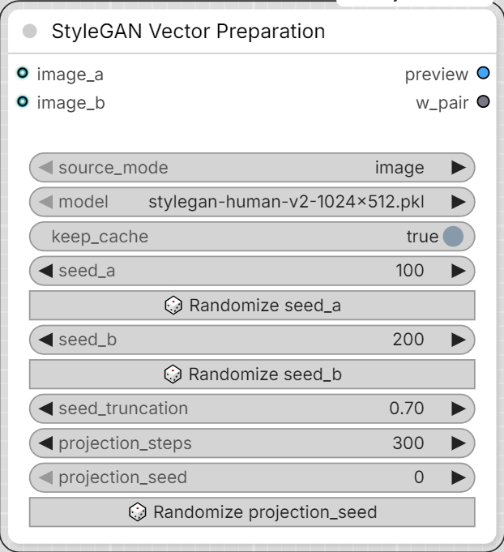
</p>


Builds the two W-space extremes of a new vector and previews them -
**nothing is ever written to disk by this node.** Re-roll seeds or try
different photos as many times as you like; saving only happens in the
Save node below, and only once you connect this node's `w_pair` output

- **keep_cache** - on by default. While on, re-running this node just
  replays its last result instantly instead of recomputing - this is
  separate from (and more reliable than) ComfyUI's own graph caching,
  which some upstream image-source nodes defeat by always reporting
  "changed" even when the image content is identical, forcing a full
  (slow) re-projection on every single queue - e.g. just from clicking
  the unrelated "Save" (JSON-only) button on the Vector Save node and
  then queuing again. Turn it off to force a genuinely fresh computation
  (new seeds, new photos), then back on once you like the result and
  just want repeated queues to reuse it.
into it.

- **source_mode** - `image` or `seed`, picks how `w_a`/`w_b` are produced:
  - `image` - **image_a** / **image_b** (two extremes, e.g. a short-hair
    photo and a long-hair photo) get GAN-inverted into W space (latent
    optimization against a VGG16 feature loss, the same algorithm as
    NVIDIA's official `projector.py`) - works from real photos, but takes
    anywhere from under a minute to a few minutes per image depending on
    `projection_steps` and your GPU, and the projection itself adds a bit
    of reconstruction noise to the result.
  - `seed` - **seed_a** / **seed_b** are mapped straight to W, no photos
    and no projection at all - this is the same trick the original
    `generate2.py`'s seed-pair vector builder used. Instant, and noise-free
    in the sense that there's no projection error, but the vector is only
    as clean as how well-matched the two seeds happen to be (everything
    that differs between the two faces bleeds into the vector, not just
    what you're after) - use the node's own **🎲 Randomize seed_a** /
    **🎲 Randomize seed_b** buttons to search for a well-matched pair (the
    same way the old Gradio UI's dice button did) and check the two faces
    in the preview output before committing to a name. These are plain
    buttons, not ComfyUI's built-in `control_after_generate` - two of
    those on the same node fight each other (their dropdowns end up
    mirroring one another), and worse, auto-randomizing after *every*
    queue - even in `image` mode where the seeds aren't used at all -
    silently changes the node's inputs each time, which defeats ComfyUI's
    caching and forces a full (slow) re-run just from clicking Save on the
    Vector Save node. The buttons only reroll when you click them.
  - Whichever mode, the two extremes only need to differ in the attribute
    you want - matching pose/background/framing/lighting between them
    (e.g. editing one photo into the other rather than picking two
    unrelated photos) gives a much cleaner vector either way.
- **model** - must be the same generator you intend to use the vector with.
- **seed_truncation** - only used in `seed` mode; `truncation_psi` for
  seed_a/seed_b's mapping (0.7 matches the original `generate2.py`).
- **projection_steps** - only used in `image` mode; GAN-inversion
  iterations per image. More = closer match, slower.
- **projection_seed** - only used in `image` mode; has its own
  **🎲 Randomize projection_seed** button. Seeds the optimization's
  internal noise (noise-buffer init + per-step latent jitter) via a
  dedicated Generator instead of PyTorch's unseeded global RNG, and also
  forces deterministic cuDNN/CUDA algorithms for the duration of the
  projection (restored to whatever they were before afterward, so this
  doesn't affect other nodes) - between those two, the exact same two
  images and the exact same parameters should reliably produce the exact
  same vector. This is best-effort, not an absolute guarantee: a handful
  of CUDA kernels have no deterministic implementation at all and quietly
  fall back to their normal (slightly run-to-run-variable) behavior
  rather than erroring. Change `projection_seed` to deliberately explore
  a different optimization path for the same images.
- Outputs: **preview** (IMAGE, the two reconstructed faces side by side)
  and **w_pair** - a graph-only connection (not a file, not JSON) carrying
  `w_a`/`w_b` plus the preview image; connect it to a Vector Save node.
- A small status line under the node title mirrors the build's progress
  while it runs.

### Mykee StyleGAN Vector Save

<p align="center">
  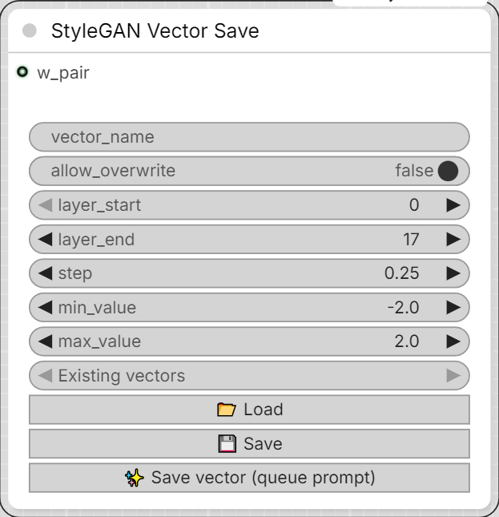
</p>


Takes a **w_pair** connection from a Vector Preparation node and, only when
`armed` is on, saves `diff = w_b - w_a` as `<vector_name>.npy` plus
`<vector_name>.json` (layer range, multiplier, min/max).

`armed` matters because this node is an `OUTPUT_NODE`, which ComfyUI runs
on **any** queue of a workflow it's part of - not just when you click this
node's own button. Without a gate, simply pressing the toolbar Run/Queue
button (e.g. to check the Preparation node's preview again) would silently
save every single time this node is wired up. `armed` defaults to off, the
`✨ Save vector` button turns it on right before queuing, and the node
turns it back off again the instant it actually runs (before doing
anything else) - so a later plain Run never re-saves on its own. You can
still flip `armed` on by hand if you specifically want one plain Run to
also save.

- **w_pair** - optional input, connect from a Vector Preparation node's
  `w_pair` output. Only needed to actually save a vector (the "✨ Save
  vector" button) - leave it disconnected entirely if you're only using
  this node's "Load"/"Save" to browse/edit existing vectors' JSON.
- **vector_name** - required for saving; also used by "Load"/"Save".
- **armed** - off by default; see above. Managed automatically by the
  "✨ Save vector" button.
- **allow_overwrite** - off by default. If `<vector_name>.npy` already
  exists, saving with this off raises an error instead of silently
  replacing it; turn it on (and confirm the browser prompt) to
  intentionally overwrite an existing vector. The "Save" button is
  unaffected by this - it only ever touches the `.json`, never the `.npy`.
- **layer_start / layer_end / step / min_value / max_value** - written into
  `<vector_name>.json` (see above).
- **Existing vectors** (dropdown, top of the node) - lists every vector
  currently on disk; picking one fills `vector_name`.
- **📂 Load** - loads `<vector_name>.json`'s current values into the
  fields above (pure REST call, doesn't need `w_pair`, `armed`, or the
  graph to run).
- **💾 Save** - writes the fields above into `<vector_name>.json`.
  Requires that `<vector_name>.npy` already exists.
- **✨ Save vector (queue prompt)** - the only normal way to actually save.
  Because `w_pair` only carries real data once the graph actually runs,
  this needs a real Queue Prompt rather than an instant button click: it
  turns `armed` on, then queues the workflow, so this node's Python
  FUNCTION saves `diff = w_b - w_a` as `<vector_name>.npy` (refusing to
  overwrite an existing one unless `allow_overwrite` is on) and writes
  `<vector_name>.json` from the current field values. The button also
  does a quick client-side check first - it warns if `w_pair` isn't
  connected, and warns/asks to confirm if `vector_name` already exists on
  disk. This node has no outputs - the preview is the Preparation node's
  job, and the result shows up in the status line below plus a toast.
- A small status line under the node title mirrors the save's progress.

### Notes / caveats

- If `models/stylegan` has no `.pkl` at all, the **model** combo on the
  Image Generation, Editor, and Vector Preparation nodes offers
  `stylegan2-ffhq-1024x1024.pkl` and `stylegan-human-v2-1024x512.pkl` by
  default (alongside whatever real files are already there) - running
  any of them with one of those selected auto-downloads it:
  - `stylegan2-ffhq-1024x1024.pkl` from NVIDIA's official CDN
    (`https://nvlabs-fi-cdn.nvidia.com/stylegan2-ada-pytorch/pretrained/ffhq.pkl`,
    ~300MB, one-time).
  - `stylegan-human-v2-1024x512.pkl` from the StyleGAN-Human project's
    Google Drive (see `requirements.txt` for the `requests` dependency
    this needs and what to do if Google Drive's download quota is hit).

  Either way, if that machine has no internet access, download the file
  by hand from the URL in the error message and place it in
  `models/stylegan/` yourself.
- The first time you project a photo (Editor, or Vector Preparation's
  `image` mode), the node downloads NVIDIA's VGG16 feature-detector
  checkpoint (~58MB) into `models/stylegan/vgg16.pt` - needs one-time
  internet access (see `requirements.txt` for the manual download URL if
  that machine is offline).
- GAN inversion quality depends a lot on the input photos being reasonably
  close to FFHQ-style framing (front-facing, centered, similar to the
  StyleGAN training data) - very different crops/angles between image_a and
  image_b will still "work" but the resulting vector may carry pose/framing
  changes along with whatever attribute you meant to isolate. Use
  `layer_start`/`layer_end` (on the Save node) to restrict the vector to
  the layers that actually carry the attribute you want - see "Layer
  reference" above.
- Photo-based vectors for color-only attributes (eye color, skin tone) are
  the hardest to build well: the projection's VGG16 feature-distance loss
  is much more sensitive to structure/shape than to exact color, and the
  colored region (an iris, say) is a tiny fraction of the frame - so there's
  little pressure on the optimizer to reproduce it precisely. If a
  color-vector isn't picking up strongly enough, try: a more exaggerated
  color difference between the two source photos, more `projection_steps`,
  and keeping `layer_start`/`layer_end` tightly restricted to the fine
  layers that actually carry color (see "Layer reference" above) so no
  structural noise from the projection leaks into the saved vector.
- The Image Generation, Editor, and Vector Preparation nodes load the
  generator lazily and cache it in memory per `.pkl` path (same process,
  so it's shared between them and repeated runs) - the first generation/
  preview/edit after choosing a model will be slower while it loads. The
  Save node never touches the generator at all - it only works with the
  `w_pair` it's given plus plain file I/O.
- The bias_act/upfirdn2d/filtered_lrelu ops each try to JIT-compile a fast
  CUDA kernel the first time they're used (needs an MSVC + CUDA build
  toolchain on PATH) and fall back automatically to a slower but fully
  portable pure-PyTorch implementation if that's not available - either way
  it works, the CUDA path is just faster. No precompiled `.pyd` is shipped
  with this pack, since one built elsewhere is tied to that exact
  Python/torch build and won't load on a different ComfyUI install (that's
  the `DLL load failed while importing bias_act_plugin` error some builds
  of this node used to hit).

## Mykee/Image - Mykee Color Background

<p align="center">
  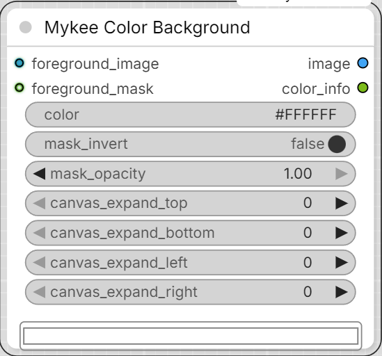
</p>


Composites a foreground image (optionally with a mask acting as its alpha
channel) onto a solid color background - the same idea as comfy_mtb's
["Colored Image"](https://github.com/melMass/comfy_mtb) node, but with a
proper top-level color widget instead of comfy_mtb's old dedicated
custom-button widget: a normal hex text field (typable, and right-click
-> "Convert widget to input" to drive it from a STRING output) with a
live native color-picker swatch underneath it, always showing the
currently selected color.

- **foreground_image** (IMAGE, required) - the image to composite. Its
  own size is what `canvas_expand_*` (below) grows outward from.
- **foreground_mask** (MASK, optional) - the foreground's alpha channel.
  If not connected, the foreground is treated as fully opaque (only the
  `canvas_expand_*` padding, if any, shows the background color).
- **color** - background color as a hex code, e.g. `#FF8800`. Type it
  directly, pick it with the swatch, or convert it to a STRING input.
- **mask_invert** - inverts `foreground_mask` before it's used as the
  alpha channel. Affects the composited output image only, not the mask
  input itself.
- **mask_opacity** (0-1) - scales the mask's alpha. `1.0` = use the mask
  as-is; `0.0` = fully transparent (only the background color shows).
- **canvas_expand_top / bottom / left / right** (pixels, default `0`) -
  grows the canvas beyond the foreground image's own size in that
  direction, filled with the background color.

Outputs:

- **image** (IMAGE) - the composited result.
- **color_info** (STRING) - the resolved background color as a
  normalized `#RRGGBB` hex code.

## Mykee/Image - Mykee Image Switch

<p align="center">
  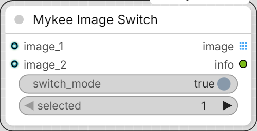
</p>


A 2-input image switch with real passthrough for the "one branch is
inactive" case - most switch nodes' single output only ever maps to
input 1 when something upstream is disabled, even if input 2 is the one
that's actually alive.

**Important:** "disabling the switch" means turning OFF the
`switch_mode` widget below, **not** using ComfyUI's own node
Bypass/Mute (right-click a node -> Mode) on this node itself. A bypassed
node's Python code never runs at all - ComfyUI's core engine handles
bypass passthrough itself, purely by matching input/output slots
positionally (so a 2-input/1-output node like this one would always
fall back to input 1, whether or not it's actually active), and that
can't be customized from node code. That is exactly the "no passthrough"
problem this node exists to avoid, so bypassing this node via the canvas
Mode menu would just reproduce the same problem one level up - use
`switch_mode` instead (same reasoning as `MykeeInvertMaskToggle`'s
own "enabled" widget elsewhere in this pack).

`image_1` / `image_2` are optional inputs, so if the node feeding one of
them is itself bypassed/muted, ComfyUI's own passthrough already
resolves that connected-but-inactive branch to nothing - this node just
sees that input as not present, no special detection needed.

- **switch_mode** (BOOLEAN, default ON) - ON = switch mode (`selected`
  picks between the two inputs); OFF = **batch mode** (active inputs are
  passed through one after another, each at its own original size,
  instead of picking one). See above for the important caveat.
- **selected** (1 or 2) - which input to use when `switch_mode` is ON
  and both `image_1`/`image_2` are active. Ignored otherwise.
- **image_1** / **image_2** (IMAGE, optional).

Behavior:

- switch ON, both active -> `selected` picks 1 or 2.
- switch ON, one active -> that one, regardless of `selected`.
- switch ON, neither active -> the `image` output is blocked (via
  ComfyUI's `ExecutionBlocker`) for anything downstream that needs it -
  no hard crash/traceback, other independent parts of the workflow keep
  running. Older ComfyUI versions without `ExecutionBlocker` fall back
  to a plain error instead.
- switch OFF, both active -> both images pass through as a real ComfyUI
  *list* (`OUTPUT_IS_LIST`), not merged into one stacked tensor - so
  each keeps its own original width/height, no resizing. Downstream
  nodes (Mykee Color Background, Save Image, ...) automatically run
  once per image at that image's own size (ComfyUI's built-in list
  processing). The trade-off: a node that specifically wants one true
  multi-frame batch tensor for batched inference runs once per image
  instead of once for both.
- switch OFF, one active -> that one, unbatched.
- switch OFF, neither active -> same blocked-output behavior as above.

Outputs:

- **image** (IMAGE) - technically always a ComfyUI *list* under the
  hood (`OUTPUT_IS_LIST`), so downstream nodes run once per image in
  batch mode; a single-image case (switch mode, or only one active) is
  just a length-1 list, which behaves identically to a plain single
  image for anything consuming it - no difference to notice there.
- **info** (STRING) - a short human-readable note on which branch was
  used and why, useful for debugging a graph. Unlike `image`, this
  string is always a real value, even when `image` is blocked - handy
  for a debug/text node downstream of just this output.

## Mykee/Image - Mykee Image Switch (Advanced)

<p align="center">
  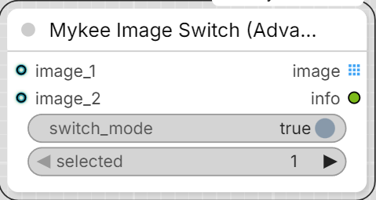
</p>


Same idea as Mykee Image Switch, but with any number of image inputs
instead of a fixed 2 - the node starts with `image_1`/`image_2`, and a
new empty input appears automatically as soon as you connect something
to the currently-last one, so there's always a free slot to grab next.
Disconnecting trims trailing empty inputs back down to a single spare
(never below `image_1`/`image_2`, and never touching a socket that's
still connected).

Same important caveat as the base switch applies: `switch_mode` OFF is
**batch mode** (see below), and "disabling the switch" means turning
that widget off, **not** ComfyUI's own node Bypass/Mute on this node
itself - see the base switch's section above for why.

- **switch_mode** (BOOLEAN, default ON) - ON = switch mode (`selected`
  picks which active input to use); OFF = **batch mode** (every active
  input is passed through one after another, each at its own original
  size, in `image_1`, `image_2`, ... order).
- **selected** - which input number to use when `switch_mode` is ON and
  more than one input is active. Must be one of the currently active
  input numbers - if it isn't, the node raises an error rather than
  guessing. Ignored when only one input is active, or in batch mode.
- **image_1, image_2, ...** (IMAGE, optional, dynamic).

Behavior:

- switch ON, exactly one input active -> that one, regardless of
  `selected` (auto-passthrough).
- switch ON, 2+ inputs active -> `selected` must name one of the active
  inputs, or execution stops with a real error - this is a deliberate
  mistake on your part (you picked an input you know is empty), so it
  stays a hard error rather than being silently forgiving.
- switch ON, none active -> the `image` output is blocked (via
  ComfyUI's `ExecutionBlocker`) for anything downstream that needs it -
  no hard crash/traceback, other independent parts of the workflow keep
  running. Older ComfyUI versions without `ExecutionBlocker` fall back
  to a plain error instead.
- batch mode, 2+ inputs active -> all of them pass through as a real
  ComfyUI *list* (`OUTPUT_IS_LIST`), in `image_1`, `image_2`, ... order -
  not merged into one stacked tensor, so each keeps its own original
  width/height, no resizing. Downstream nodes (Mykee Color Background,
  Save Image, ...) automatically run once per image at that image's own
  size (ComfyUI's built-in list processing). The trade-off: a node that
  specifically wants one true multi-frame batch tensor for batched
  inference runs once per image instead of once for all of them.
- batch mode, exactly one active -> that one, unbatched.
- batch mode, none active -> same blocked-output behavior as above.

Outputs:

- **image** (IMAGE) - technically always a ComfyUI *list* under the
  hood (`OUTPUT_IS_LIST`), so downstream nodes run once per image in
  batch mode; a single-image case (switch mode, or only one active) is
  just a length-1 list, which behaves identically to a plain single
  image for anything consuming it - no difference to notice there.
- **info** (STRING) - a short human-readable note on which branch was
  used (or how the batch was assembled) and why, useful for debugging a
  graph.

## Mykee/Conditioning - Mykee Switch Conditioning

<p align="center">
  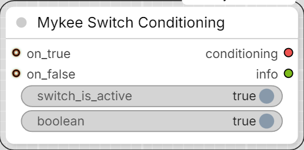
</p>


A rework of Crystian's ["Switch conditioning"](https://github.com/crystian/comfyui-crystools)
node from ComfyUI-Crystools, with more forgiving logic for the common
case where only one of the two branches is actually wired up. The
original treats `on_true`/`on_false` as required and always follows
`boolean` literally regardless of whether the input it points to is
connected - so leaving one branch unplugged while iterating on a graph
is a hard error, even though the obvious intent is "just use whichever
one is there".

**Important:** "disabling the switch" means turning OFF the
`switch_is_active` widget below, **not** using ComfyUI's own node
Bypass/Mute (right-click a node -> Mode) on this node itself - same
reasoning as Mykee Image Switch above: a natively bypassed node's
Python code never runs at all, so it can't apply this node's logic.

- **switch_is_active** (BOOLEAN, default ON) - ON = normal switch mode
  (`boolean` picks between `on_true`/`on_false` when both are active);
  OFF = **bypass mode** (the switch is treated as inactive - `boolean`
  is ignored).
- **boolean** (BOOLEAN, default ON) - used only when `switch_is_active`
  is ON and both inputs are active: ON -> `on_true`, OFF -> `on_false`.
  Ignored when only one input is active, or when `switch_is_active` is
  OFF.
- **on_true** / **on_false** (CONDITIONING, optional).

Behavior:

- exactly one input active -> that one, **regardless of
  `switch_is_active` or `boolean`** - there's nothing to decide.
- both active, switch_is_active ON -> `boolean` picks `on_true` (ON) or
  `on_false` (OFF).
- both active, switch_is_active OFF (bypass) -> ambiguous (no selector
  is in effect), so the `conditioning` output is blocked via ComfyUI's
  `ExecutionBlocker` for anything downstream that needs it - no hard
  crash/traceback, other independent parts of the workflow keep
  running. Older ComfyUI versions without `ExecutionBlocker` fall back
  to a plain error instead.
- neither active -> same blocked-output behavior as above.

Outputs:

- **conditioning** (CONDITIONING).
- **info** (STRING) - a short human-readable note on which branch was
  used (or why the output was blocked), useful for debugging a graph.
  Unlike `conditioning`, this string is always a real value, even when
  `conditioning` is blocked.

## Mykee/Prompt - Mykee Prompt Template

<p align="center">
  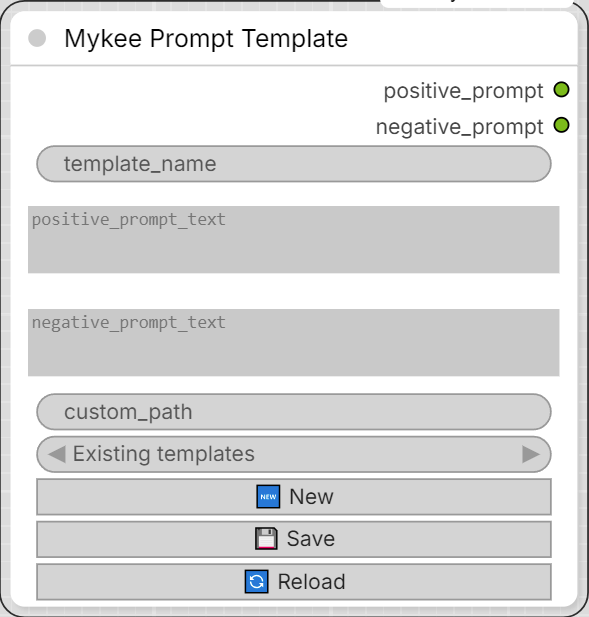
</p>


A small prompt library node. `positive_prompt_text` and
`negative_prompt_text` are real, multiline STRING widgets - together
they're always what the node outputs, whatever you last typed or
loaded. "Load" / "Save" / "Reload" just move both of them to and from
disk together, one plain JSON file per template (mirroring how this
pack's StyleGAN vectors are each their own `.npy`/`.json` pair).

Storage location:

- By default, `ComfyUI/user/default/Prompt templates/`.
- If `custom_path` is filled in, that folder is used instead (created if
  it doesn't exist yet).

Each template file holds `{"prompt": "...", "negative_prompt": "..."}`.
Older files saved before the negative-prompt field existed
(`{"text": "..."}`) still load fine - as a positive prompt with an
empty negative prompt.

Picker and buttons:

- **Existing templates** (dropdown) - picking an entry loads it
  immediately, overwriting both `template_name` and the two prompt
  boxes. There's no separate Load button - selecting IS loading.
- **🔄 Reload** - re-fetches the list of templates on disk (at whatever
  `custom_path` is right now) into the "Existing templates" picker -
  useful after adding/renaming a file by hand, or after changing
  `custom_path`. Also runs automatically when the node is created.
- **🆕 New** - clears `template_name` and both prompt boxes, for
  starting a fresh template from blank instead of editing whatever was
  last loaded/typed.
- **💾 Save** - writes both prompt fields out together under
  `template_name`. The name is sanitized so the resulting file is valid
  on both Windows and Linux (forbidden characters stripped, trailing
  dots/spaces trimmed, Windows-reserved device names like `CON`/`COM1`
  prefixed with `_`) - if that changes the name, `template_name` is
  updated to match what was actually saved.

Unlike the StyleGAN Vector Save node, none of this needs the graph to
run - Save fires its REST call immediately, with no "armed"/queue step.

Inputs:

- **template_name** (STRING) - name for this template; also its file
  name once saved. Only needed for Load/Save - the node runs fine with
  it empty.
- **positive_prompt_text** (STRING, multiline) - the positive prompt
  text.
- **negative_prompt_text** (STRING, multiline) - the negative prompt
  text.
- **custom_path** (STRING) - optional folder override, see above.

Outputs:

- **positive_prompt** (STRING) - `positive_prompt_text`, unchanged.
- **negative_prompt** (STRING) - `negative_prompt_text`, unchanged.

## Mykee/Utils - Mykee Model Template

<p align="center">
  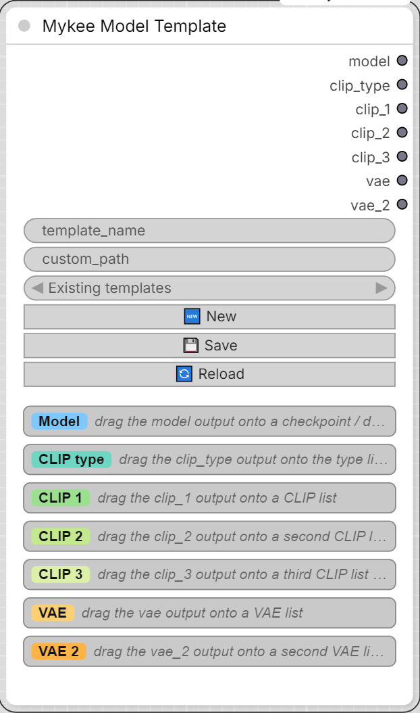
</p>


Remembers which CLIP / VAE files (and which CLIP type) belong to which
model, so you don't have to keep that in your head. The node has seven
outputs - **model**, **clip_type**, **clip_1**, **clip_2**, **clip_3**,
**vae** and **vae_2** (for models that need two VAEs) - and you drag each one
onto the file-list (combo) widget of a loader node: `ckpt_name` of a
checkpoint loader, `unet_name` of a diffusion-model loader,
`clip_name` / `clip_name1..3` of the CLIP loaders, `type` of a CLIP
loader (for **clip_type**: stable_diffusion, flux, sd3, ...), `vae_name` of a VAE
loader. The output then takes over that widget's type (like a Primitive
node), the node's panel shows the loader's own file list as a dropdown,
and whatever is selected there is what the loader receives. Only the
outputs you actually need have to be connected - a single CLIP, two or
three, or none at all.

Templates are one small JSON file each, with the selection of the
**connected** outputs:

```json
{"version": 1, "model": "sdxl/mymodel.safetensors", "clip_type": "stable_diffusion", "clip_1": "clip_l.safetensors", "vae": "sdxl_vae.safetensors"}
```

Storage location:

- By default, `ComfyUI/user/default/Model templates/`.
- If `custom_path` is filled in, that folder is used instead (created if
  it doesn't exist yet).

Loading a template is careful about what it touches. An entry is applied
only if **its output is connected AND the file name is in the list of the
widget it is connected to**. Everything else is left exactly as it is:

- model + VAE in the template, but no CLIP connected -> the model and the
  VAE are selected, nothing else changes.
- a file from the template is not installed on this machine -> that list
  keeps its current selection.
- an entry missing from the template (e.g. no `clip_3`) -> that output
  keeps its current selection.

A short message after every load tells what was applied and what was
skipped (and why). Folder separators don't matter when matching
(`sub\model.safetensors` from Windows matches `sub/model.safetensors`
on Linux), and a different upper/lower case is tolerated as a fallback.

Picker and buttons (same as in Mykee Prompt Template):

- **Existing templates** (dropdown) - picking an entry loads it
  immediately. There's no separate Load button.
- **🔄 Reload** - re-fetches the template list (at the current
  `custom_path`) and re-reads the connected file lists - useful after
  adding model files and refreshing the loaders.
- **🆕 New** - clears `template_name` for a fresh template. The current
  selections stay, so a similar setup can be saved under a new name.
- **💾 Save** - writes the selection of the connected outputs under
  `template_name` (sanitized like in the Prompt Template node).

Notes:

- Each output only accepts combo (list) widgets. If an output drives
  several widgets, they must have identical lists.
- If a remembered file is no longer in the list (e.g. after loading an old
  workflow on another machine), the dropdown shows it marked with `⚠`
  instead of silently switching to another file.
- The panel's **↻** button next to a list re-reads that list.

Inputs:

- **template_name** (STRING) - name of the template; also its file name.
- **custom_path** (STRING) - optional folder override, see above.

Outputs (all `*`, they take the type of the widget they are connected to):

- **model**, **clip_type**, **clip_1**, **clip_2**, **clip_3**, **vae**, **vae_2** - the
  selected entries (nothing for outputs that are not connected).

## Mykee/Utils - Mykee Seed

<p align="center">
  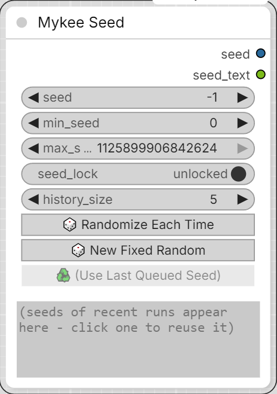
</p>


A reworked version of the **Seed** node from
[rgthree-comfy](https://github.com/rgthree/rgthree-comfy) (MIT License,
see `THIRD_PARTY_NOTICES.md`). It works standalone - rgthree-comfy does
not need to be installed. It keeps the original's behavior (a seed that
is generated in the browser right before the workflow is queued, so the
real seed also ends up in the saved image metadata) and changes two
things:

- The random range is no longer hidden in the node's *Properties* panel:
  **min_seed** and **max_seed** are regular widgets on the node.
- A new **seed_lock** switch (see below).

The seed widget is called `seed_value` (label: "seed"). It is deliberately
not named `seed`, because ComfyUI would attach its own "control after
generate" combo to a widget with that exact name.

Special values of `seed_value`:

- **-1** - a new random seed (within `min_seed` .. `max_seed`, both
  inclusive) on every run. This is the default for a new node.
- **-2** / **-3** - the last used seed + 1 / - 1 (falls back to a random
  seed if there is no last seed yet). Type them in by hand.
- Any other value is used as is.

Buttons:

- **Randomize Each Time** - sets `seed_value` to -1.
- **New Fixed Random** - draws one random seed from the range right now
  and puts it into `seed_value`.
- **Use Last Queued Seed** - shows the seed used by the last run (only
  enabled if it differs from the current value); a click puts it into
  `seed_value`.

### seed_lock

- **unlocked** (default) - the classic behavior: with `seed_value` = -1,
  every run gets a new random seed and `seed_value` stays at -1. Keeping
  a seed you liked means pressing *Use Last Queued Seed* yourself.
- **locked** - whenever a seed is generated from a special value (-1, -2,
  -3), it is written into `seed_value` right away. The seed is "locked"
  without pressing anything, and the following runs keep using it. To get
  a new one, press *Randomize Each Time* (or type -1), which then locks
  the next generated seed again. A seed you typed in yourself is never
  touched.

### Seed history

A read-only text box at the bottom of the node lists the seeds of the most
recent runs, **newest on top**. Once the list is full (`history_size`
entries), the oldest one drops off. A seed that is used again (e.g. while
seed_lock keeps the same one) moves to the top instead of being listed
twice, so the list always shows distinct seeds.

**Click a line** to put that seed into `seed_value`. (Selecting text with
the mouse, e.g. to copy a seed, does not count as a click.)

The box exists only in the browser - it is never sent to the server, so it
cannot make the node or anything downstream re-run. The list itself is
stored in the node's properties (`mykee_seed_history`), so it survives a
page reload and is saved with the workflow (and therefore also ends up in
the workflow metadata of saved images). Lowering `history_size` trims the
list immediately.

Notes:

- With seed_lock **on**, *Run (x N)* / batch count uses the same seed for
  all N runs (the first run generates and locks it) - ComfyUI will
  usually skip the repeated runs because nothing changed. Use it
  **off** for batches of different seeds.
- A muted or bypassed Mykee Seed node is ignored. Nodes inside subgraphs
  are supported.
- If a special seed reaches the server anyway (an API call passing -1
  without the ComfyUI frontend), the server generates one from the
  min/max range and writes it into the prompt/metadata; `seed_lock` only
  works from the ComfyUI frontend.

Inputs:

- **seed_value** (INT) - see above.
- **min_seed** (INT, default 0) - lower bound of the random range.
- **max_seed** (INT, default 1125899906842624) - upper bound of the
  random range. If min is larger than max, the two are swapped.
- **seed_lock** (BOOLEAN, default off) - see above.
- **history_size** (INT, 1-50, default 5) - how many recent seeds the
  history box keeps.

Outputs:

- **seed** (INT) - the seed to use for this run.
- **seed_text** (STRING) - the same seed as text, e.g. for file names,
  so it does not need a separate INT-to-text conversion.

## Mykee/Utils - Mykee XYZ Plot / Mykee XYZ Plot Assembler

<p align="center">
  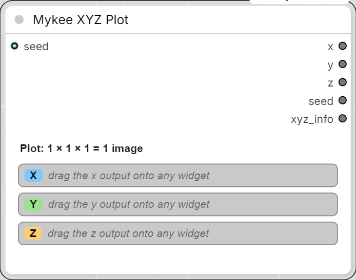
  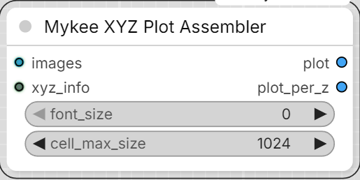
</p>


A universal XYZ plot: **any widget parameter of any node** can be an axis
(cfg, steps, sampler_name, ckpt_name, lora strength, seed, a prompt text,
a boolean switch, ...). No per-node axis types to pick from a list - you
connect the axis to the parameter itself.

### Setup

1. Add **Mykee XYZ Plot** and drag its **x** / **y** / **z** outputs onto
   the widgets you want to vary (the same way a Primitive node is
   connected). The output takes over the widget's type and name
   (e.g. `x: cfg`), and the node shows an editor for that axis:
   - **INT / FLOAT** - comma separated values and/or ranges:
     `5, 7.5, 10` or `4:12:2` (`start:end:step`, end inclusive). INT axes
     also get a **🎲 random** button (random values, e.g. for a seed axis).
   - **STRING** - one value per line.
   - **combo** (models, samplers, schedulers, LoRAs, ...) - the widget's
     own option list with a filter box, checkboxes and all / none buttons,
     so you can pick e.g. 5 models out of 20.
   - **BOOLEAN** - true / false checkboxes.
   Unused axes simply stay unconnected (an XY or a one-axis plot is fine).
   One axis output can drive several widgets at once, as long as they have
   the same type (and, for combos, the same option list).
2. Connect **xyz_info** to a **Mykee XYZ Plot Assembler**, and the image
   to plot (e.g. the VAE Decode output) to its **images** input.
3. Optional: connect a seed (e.g. from Mykee Seed) to the **seed** input.
   It is passed through on the **seed** output and printed in the plot's
   title.
4. Run. The top of the panel shows the size, e.g. `Plot: 3 × 2 × 2 = 12 images`.

### How a run works

One Run is split into one prompt per cell (Z outermost, X innermost), all
queued at once. In each cell's prompt the axis links are replaced by that
cell's literal value, exactly like a Primitive node would do it. Because of
that, ComfyUI's cache only re-runs what actually changed between two cells:

- **Put the slowest parameter (e.g. the checkpoint) on Z**, then Y: the
  model is loaded once per Z value, not once per cell.
- Every cell is a normal prompt, so a Save Image node after the sampler /
  decoder saves each cell with its own correct metadata.
- Random seeds (Mykee Seed at -1, KSampler "randomize") are resolved once
  per Run, so all cells of a plot use the same seed.

The Assembler shows the partial grid (missing cells in grey) after every
cell. Its outputs are blocked until the last cell has arrived, so a Save
Image node after it only saves the finished table.

Assembler inputs:

- **images** - the cell's image (from a batch, only the first image is used).
- **xyz_info** - from Mykee XYZ Plot.
- **font_size** - label size in pixels, 0 = automatic.
- **cell_max_size** - cells are scaled down to at most this size (longer
  side), 0 = original size. Cells with a different aspect ratio / size are
  letterboxed into the first cell's size.

Assembler outputs:

- **plot** - the whole table in one image: per Z value one grid (column
  headers = X values, row headers = Y values, title = the parameters on the
  axes + seed), stacked below each other.
- **plot_per_z** - the same grids as a batch, one image per Z value.

Notes:

- Only one active Mykee XYZ Plot node per workflow (mute / bypass the
  others). Above 100 cells you are asked to confirm before queueing.
- Model file names are shown without folder and extension in the labels.
- The splitting into cells happens in the ComfyUI frontend. A prompt sent
  directly through the API only renders the first cell.
- After refreshing the model lists, press **↻** on the axis to re-read the
  connected combo's options.

## Mykee/Prompt - Mykee Text Switch/Batch

<p align="center">
  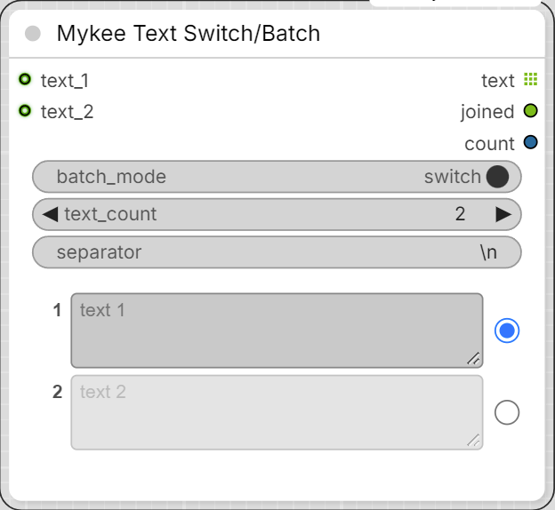
</p>


Up to 49 numbered text fields on one node, each with a selector at its end.

- **batch_mode** (top switch):
  - **switch** - each field has a radio button; only the selected text goes
    out (even if it is empty).
  - **batch** - each field has a checkbox; every ticked, **non-empty** text
    goes out, in field order. **select all** / **clear all** buttons tick or
    untick every field. The switch-mode selection and the batch-mode ticks
    are remembered separately, so flipping the mode loses neither.
- **text_count** - number of fields, 0-49 (default 2). Texts of fields you
  hide are kept, and come back when you raise the count again.
- **separator** - separator of the `joined` output (`\n` = new line,
  `\t` = tab).

Inputs: every field has its own optional **text_N** input socket. A
connected input replaces the field's typed text (the field is then shown
read-only), but its radio button / checkbox still decides whether it is
used. The inputs are lazy: an input whose field is not selected is never
evaluated.

Outputs:

- **text** - a list: in switch mode one text, in batch mode all selected
  texts. The nodes after it run once per text (e.g. CLIPTextEncode ->
  KSampler renders one image per text).
- **joined** - the same texts in one string, joined with `separator`.
- **count** - how many texts went out.

If nothing is selected (or every ticked field is empty in batch mode), the
outputs are blocked, so nothing after the node runs.

Only the fields that are actually used are sent to the server, so typing
into a field that is not selected does not make anything re-run.

## Mykee/Prompt - Mykee Before/After Text Injection

<p align="center">
  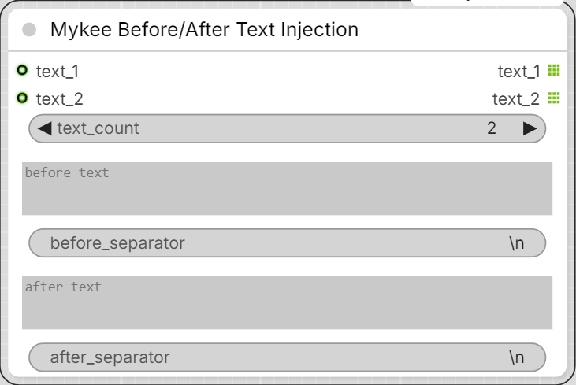
</p>


Puts the same text in front of and after many texts at once: every
**text_N** input comes out on its own **text_N** output as

    before_text + before_separator + text + after_separator + after_text

- **text_count** - number of input / output pairs, 1-50 (default 2).
- **before_text** / **after_text** - what goes in front of / after every
  text.
- **before_separator** / **after_separator** - default `\n` (new line;
  `\t` = tab). A separator is only used when its text is not empty: an
  empty before_text also drops before_separator, an empty after_text drops
  after_separator.

An input that is not connected (or an empty text) gives only the before
and after text, joined by before_separator.

Lists are kept per pair: a list input (e.g. the batch output of Mykee Text
Switch/Batch) comes out as a list of the same length on its own output,
without affecting the other pairs.

Bypass: a bypassed node passes every text_N input straight through to its
text_N output, unchanged. For that the text inputs have to be the node's
only sockets, so the widgets (before / after texts, separators,
text_count) cannot be converted to inputs.

## Mykee/Image - Mykee Stripe Remover

<p align="center">
  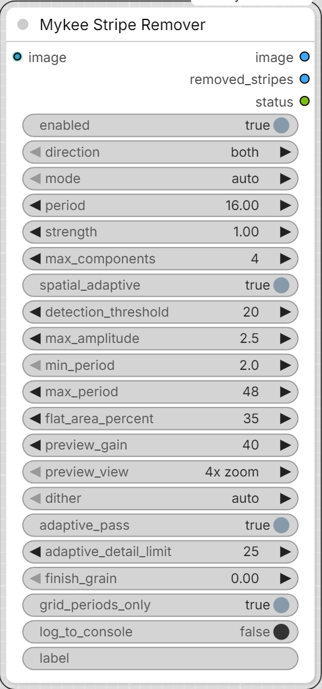
</p>


Removes faint, periodic **horizontal and/or vertical stripes** from an image.
Built for the banding that DiT image models (Chroma, Flux family, ...) can
show when they are run far above their training resolution: 8x VAE
downsampling x 2x2 patches = a **16 px grid**, so the stripes repeat every
16 px (plus harmonics: 8 px, 5.33 px ...). They are easiest to see in smooth
areas such as sky. This is **not** a VAE artifact, so VAE-specific filters
(e.g. 2 px grid removers for the Qwen / Wan VAEs) do not help here.

Nothing has to be tuned - the node measures the stripes from the image it
receives:

1. The smoothest part of the picture (sky, walls, smooth skin) is found
   automatically. Only that part is used for measuring, so real detail
   cannot be mistaken for stripes.
2. The row (column) signal of that area is searched, **tile by tile**
   (two segment lengths, 512 and 1024 rows),
   (up to 6 x-zones x 512-row segments), for a sharp periodic peak; the
   sharpest tile wins. (A whole-image signal is diluted by everything else
   that is smooth, e.g. sea ripples: on one test image the 16 px stripes of
   the sky had a local strength of 381 but only ~10 over the whole image.) The period is refined to sub-pixel accuracy, so it also works on
   images that were resized after generation (non-integer periods).
3. The period is refined to a fraction of a pixel with a coherent fold and
   snapped to an integer when it is that close (patch and VAE grids are
   integer periods; a 0.1 px error at 16 px would drift ~13 px over 2048
   rows and cancel the measurement).
4. One full period of the stripe pattern (all harmonics included) is folded
   out of the image with a matched high-pass filter - separately for each
   colour channel and for a grid of zones (x and y), because the stripe
   strength differs across the image and the phase of the stripes wanders
   slowly from top to bottom.
5. The pattern is subtracted.
6. **Adaptive pass** (see `adaptive_pass`): the stripes are then followed
   locally in amplitude and phase, which also removes them from textured
   areas such as skin. It is a tiny periodic pattern, so **no blur
   is applied to the image** and fine texture is not softened.

Up to `max_components` different periods are removed one after another per
direction. On Chroma/Flux images typically 4 px and 8 px (VAE decoder grid)
and 16 px and 32 px (DiT patch grid) show up; the strongest peak goes first.

Place it right after **VAE Decode** (before any sharpening or upscaling -
those amplify the stripes).

### Outputs

- **image** - the cleaned image.
- **removed_stripes** - exactly what was subtracted, amplified around grey
  (`preview_gain`). With the default `4x zoom` it shows a magnified centre
  crop where the stripes are clearly visible; the cleaned image is never
  cropped. A nearly flat grey preview means there was (almost) nothing to
  remove.
- **status** - the log of the current run as text (one line per message; a
  batch gets one block per image: `Image 1/4:`, `Image 2/4:` ...; the numbering
  starts again with every run), with a one-line header like
  `21:04:33  2048x2048, node 7, <label>`. There is no
  text box on the node; to read the log either connect this output to a text
  display node, or switch on `log_to_console` (off by default) and read it in
  the ComfyUI console window - every run is printed there as
  `[Mykee Stripe Remover] 21:04:33 ...`. The optional `label` input (e.g. a seed or
  a file-name prefix) is added to the header. Each direction ends
  with `strongest peak left X px N x (first found M x)`: the sharpest periodic
  peak that is still in the cleaned image, measured in float, so it also
  works where an 8-bit saved copy is too coarse to judge. Example:
  `horizontal: removed 16.00px (strength 310x, rms 0.42/255, fitted 16.07) - flat area used: 35%`.
  `fitted` appears when the measured period was snapped to an integer.

### Settings

- **enabled** - off = the image passes through untouched (A/B comparison).
- **direction** - `both` / `horizontal stripes` (lines running left-right,
  the pattern changes from row to row) / `vertical stripes`. `both`
  measures each direction separately and only removes what is really there.
- **mode / period** - `auto` measures the period. `manual` uses `period`
  (px) instead, e.g. `16`.
- **strength** - 1.0 = remove the measured stripes fully; lower = partial.
- **max_components** - how many different periods may be removed per
  direction (default 4).
- **spatial_adaptive** - measure the stripes in a grid of zones (up to 12 x 8)
  instead of one global profile. The grid is about 170 px wide and 256 px
  tall per cell (up to 12 x 8) - the stripe strength was measured to change
  by a factor of 5 within ~700 px at the top of a 2048 px image.
- **detection_threshold** - auto mode: how sharp a periodic peak must be
  (peaks at the known grid periods 16/k px - 16, 10.67, 8, 6.4, 5.33, 4.57,
  4 ... 2 px - only need 40% of this value; on a test image a real 16 px
  stripe had strength 37 and was missed at the plain threshold of 40)
  (compared with the noise around it) to count as stripes. The status line
  shows the measured strength, so you can see how far above the threshold
  your stripes are. Lower = more sensitive, higher = safer against false
  detections. If the status says "no periodic stripes found" although you
  can see stripes, lower it.
- **max_amplitude** - safety limit (rms, 1/255 units, default 2.5) for all
  removed patterns together. Real stripe artifacts measured 0.1-0.6 rms; more
  than this is treated as real content (e.g. corrugated metal) and left
  alone. (An existing workflow keeps its saved value - set it to 2.5 there.)
- **grid_periods_only** - on by default. Auto mode only accepts the periods
  the generators produce (VAE grid 2/4/8 px, DiT grid 16 px, harmonics 32/k
  px). In a test with a corrugated-metal picture the node had removed real
  40-60 px patterns (rms 6.6 levels, up to 32 levels) as 'stripes'; with this
  option those are left alone. A detected period is snapped to the exact
  grid period (4.03 -> 4.00 px). Off = any period (only for pictures that were
  resized after decoding). In a picture with no smooth area at all (detail of
  the flattest pixels above 10 levels) the relaxed grid threshold is not used.
- **min_period / max_period** - auto mode search range in px (default 2-48).
- **flat_area_percent** - the smoothest X% of the picture is used for
  measuring the stripes (default 35). Raise it if the image has very little
  smooth area. A picture without any truly flat area (e.g. a full-frame
  texture) is still measured: the stripes are locked to the pixel grid, the
  texture is not, so averaging over many texture pixels shows them.
- **preview_gain / preview_view** - only affect `removed_stripes`.
- **adaptive_pass** - on by default. The zone fit measures the stripes in
  the flat areas (sky) and applies the pattern everywhere. On skin the real
  stripes were measured to be about 4x stronger than in the sky and slightly
  shifted in phase, so they stayed. The adaptive pass multiplies the image
  with a complex carrier at each stripe frequency, averages it over about
  64 rows x 32 px (stripes are coherent over that area, random texture is
  not) and subtracts the local amplitude/phase it finds. A line is only
  removed as far as it stands out of its neighbouring frequencies, each line
  is capped at 1.5/255, the total at 3/255 per pixel, and the pass fades out
  around strong detail/edges. It only touches the harmonics of the periods
  that the measurement found, and only periods up to 24 px. Needs an image of
  at least 256 x 128 px. It works on a high-passed copy of the image: the
  image mean would otherwise leak through the pooling for periods that are
  not exactly 16/k px (a measured 16.07 px produced fake stripes of about
  1 level in v5). Real periodic structure (brickwork, fences, hard edges: a
  line amplitude of many levels) is excluded from the averaging (cells above
  about 3 levels get ~0 weight before the smoothing) and the correction in a
  cell never exceeds what that cell itself measures (v20). Before, such
  structure leaked into smooth areas next to it: a synthetic test gave
  +1.0 levels of fake 16 px stripes on a plain strip between two brick-like
  blocks, and 20% of the real structure was removed; v20 leaves both
  untouched. Off = zone fit only.
- **adaptive_detail_limit** - adaptive pass only (default 25). Local detail
  strength, in 1/255 levels, at which the pass fades out. Higher = more
  stripe removal from textured areas (skin), but closer to strong edges.
  Measured on a 2048 px test image: 15 -> thigh stripe 1.42 -> 0.60 levels,
  25 -> 0.48, 40 -> 0.46 but with the correction concentrating on edges
  (rms near strong edges 0.48 vs 0.25 elsewhere).
- **finish_grain** - 0 = off (default). Soft luminance grain, rms in 1/255
  levels, added after the stripe removal **only on smooth areas**. It does
  not remove stripes; it hides the faint leftovers (a few hundredths of a
  level) where nothing else masks them, e.g. in the sky. The weight follows
  the local detail: on the 2048 px test image ~0.93-1.0 in the sky, ~0.2-0.35
  on smooth skin, ~0 on cloth, hem and face. Start with 0.5-1.0. A blur is
  deliberately not used: a 1 px blur would cut the 4 px leftovers but would
  soften every fine detail, and it does almost nothing to the 16 px stripes
  (x0.93 at sigma 1 px).
- **dither** - `auto` / `on` / `off`. Adds +-0.5/255 white noise to the
  cleaned image. If the input is an **8-bit picture** (e.g. Load Image),
  its values are already whole numbers; subtracting a stripe pattern of
  less than 1/255 and saving to 8 bit (ComfyUI truncates) turns that
  pattern into a *new* 1-level stripe pattern in smooth areas - measured to
  make some regions worse than the unprocessed picture. The noise breaks
  that correlation. `auto` switches it on only when the input is detected
  as 8-bit; a fresh VAE Decode output is float and does not need it.

### Notes

- The measurement needs some smooth area. With a picture that is almost
  all texture the node says so in the status line and leaves the image
  alone.
- Stripes that are sub-LSB in a finished 8-bit file can only be removed
  with `dither` on (see above); the best place for the node is directly
  after VAE Decode, where the image is still floating point.
- Batches are processed image by image, each with its own measurement.

## Mykee/Latent - Mykee Latent Nyquist Notch

<p align="center">
  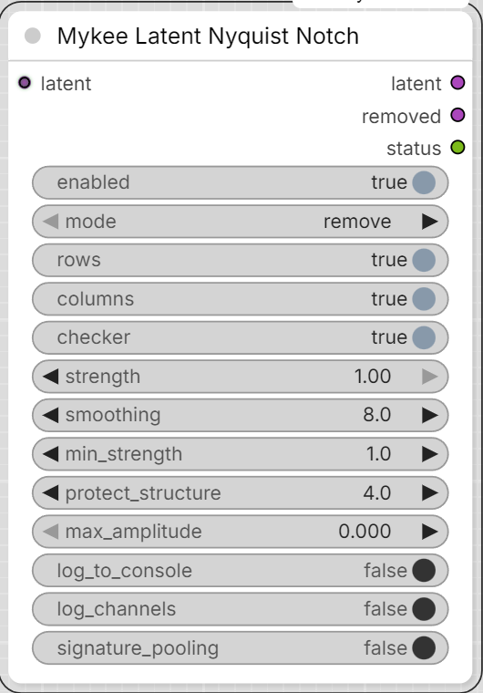
</p>


Removes the component of a **LATENT** that alternates every single latent
pixel (the Nyquist frequency), before the VAE decode. DiT models that
patchify the latent in 2x2 blocks (Flux / Chroma / Qwen Image ...) can leave
a faint 2-latent-pixel pattern behind; with an 8x VAE that is a 16 px stripe
or grid pattern in the decoded image, and it gets stronger at high
resolution (e.g. Chroma above 1024 px). The node is **experimental**: it was
written from measurements of decoded images, not of latents - run it once
with `mode = measure_only` first and read the status.

The idea of a Nyquist notch comes from
[ComfyUI-DeGrid](https://github.com/lunaaispace-eng/ComfyUI-DeGrid)
(Apache-2.0), which removes the 2 px grid of the Qwen/Wan VAEs from decoded
*images*. This node works on *latents* with a different, narrow-band method;
no code was copied.

Place it after every sampler pass that produces stripes, directly before the
next step that consumes the latent (`VAE Decode`, or the latent upscale of a
two-pass workflow). In a two-pass workflow (e.g. 1024 px base pass, 2x latent
upscale, second pass) use one node after each KSampler: the stripes of the
second, high-resolution pass are not touched by a node that sits only after
the first pass.

### Outputs

- **latent** - the cleaned latent.
- **removed** - what was subtracted (a LATENT; decode it only for curiosity).
- **status** - per image and per component: strength, parity lock, local
  envelope.

### Settings

- **enabled** - off = the latent passes through untouched.
- **mode** - `remove`, or `measure_only` (nothing changes, the status is
  still filled in).
- **rows / columns / checker** - which components to look for. `rows` is the
  part that alternates from one latent row to the next (horizontal stripes in
  the image), `columns` the vertical stripes, `checker` the grid.
- **strength** - how much of the measured component is subtracted (1 = all).
- **smoothing** - latent pixels over which the local amplitude is averaged
  (default 8 = 64 px in the image). Larger = narrower band, follows a drifting
  pattern less closely; smaller = follows it more closely but touches more
  real fine detail.
- **min_strength** - a component is only removed when its amplitude is this
  many times larger than the same measurement at neighbouring frequencies
  (about 1 for noise or no pattern). Below it that component is left alone.
  Default 1.0 (= always remove). The strength value is a global median and
  understates patterns that are present only in parts of a large latent: on a
  256x256 latent (2048 px image) it read only 1.3-1.4x although removal
  clearly reduced the stripes, so a threshold of 2 or more would have
  skipped it.
- **protect_structure** - cells whose local amplitude is this many times above
  the typical one are treated as real fine structure (fences, mesh, hard
  edges) and excluded; 0 = off.
- **max_amplitude** - largest correction per latent value; 0 = automatic
  (3 x the median amplitude).
- **log_to_console** - also print the status to the console.
- **log_channels** - diagnostics only, does not change the result. For every
  processed component the status also lists the signed local amplitude of each
  latent channel (x1000) averaged over the whole latent, both edge bands and
  the centre, plus the cosine similarity between these vectors. Cosines close
  to +1 between the edge bands and the whole latent mean the stripe has a
  stable per-channel pattern.
- **signature_pooling** - off by default. The stripe of one component usually
  appears in the latent channels with a fixed, signed pattern. When this is on,
  that pattern is estimated from the whole latent (channel means), the local
  per-channel amplitude is projected onto it, and one amplitude field is
  estimated from all channels together and written back through the pattern.
  Compared with the per-channel estimate this removes less noise and fine
  detail for the same `smoothing`, so a smaller `smoothing` (2-3) can be used
  with less loss of detail. It never removes more than the per-channel
  estimate: whatever does not fit the pattern stays in the latent. The auto
  limit of `max_amplitude` is replaced by 8x the rms of the pooled amplitude
  (or by `max_amplitude` when it is set). The status line shows how much of the
  amplitude energy the pooled estimate keeps; a low value means the stripe
  does not follow a single channel pattern.

### Reading the status

```
rows (horizontal stripes): strength 31.0x, parity-locked 0.0120, local envelope 0.0172 rms (1.3% of latent std) - removed
```

- **strength** - how clearly the pattern stands out. Around 1x there is no
  pattern. On small latents (e.g. 128x128) the stripes this node is meant for
  read around 3x or higher; on large latents patchy stripes can read as low
  as 1.3x and still be removed (see `min_strength`).
- **parity-locked** - amplitude when the pattern has a fixed phase over the
  whole latent. **local envelope** - amplitude measured locally. If the
  envelope is much larger than the parity-locked value, the phase drifts
  (the sign flips along the image) - the node follows that.
- If all components say "left untouched" with a raised `min_strength`, lower
  it to 1.0 and compare the result before concluding that the stripes do not
  come from a latent Nyquist pattern.
